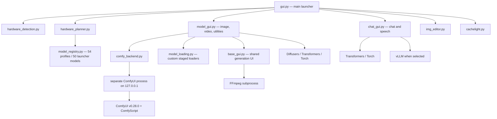
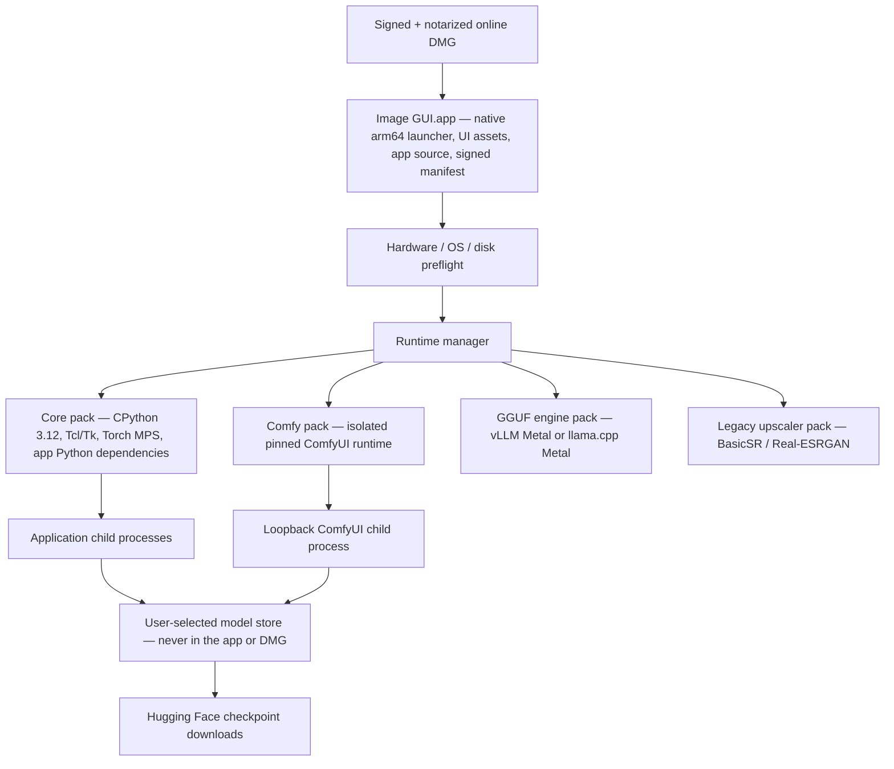

# macOS Apple Silicon release assessment

**Assessment date:** 3 October 2026

**Repository target:** Image-GUI / Local AI Workstation

**Release target:** macOS on Apple Silicon (M1 or newer)

**Source-development targets retained:** Linux with CUDA and macOS with Metal/MPS

## Executive decision

The recommended release is a **hybrid, online-first DMG**:

1. Ship a small, signed and notarized native `arm64` `.app` inside a DMG.
2. Give that app ownership of a pinned CPython 3.12 runtime. Do not use or modify a system, Homebrew, Conda, or user-installed Python.
3. On first launch, download signed, versioned dependency packs selected for macOS and Apple Silicon. Install them under the user's Application Support directory, not inside the signed application bundle.
4. Keep model checkpoints entirely outside every DMG and dependency pack. Download them only when a user selects a model, using a configurable model store with free-space checks, resumable transfers, and cache management.
5. Continue to support Linux/CUDA from source with separate locked dependency manifests. No CUDA library belongs in a macOS artifact.
6. Preserve every model and feature, but finish the two macOS backend gaps and validate every model on physical Macs before calling the release complete.

This is the middle ground between the three proposals. It provides a “double-click and it works” product without turning the DMG into a many-gigabyte, difficult-to-update dependency snapshot. A second, larger **offline-dependencies DMG** can be generated from the same pinned packs for installations without reliable internet. That artifact would still contain **zero model weights**.

> **Non-negotiable packaging invariant:** model weights are never bundled in the `.app`, DMG, Python runtime, ComfyUI pack, or any other installer artifact. The maintainers report that a fully populated development model store is close to 600 GB. The software must treat models as separately managed user data.

## What “just works” should mean

For this project, “just works” should have a testable definition:

- A user on a supported Apple Silicon Mac downloads one notarized DMG, drags the app to Applications, and launches it without using Terminal.
- The app does not require Xcode, Command Line Tools, Homebrew, Conda, an existing Python, `pip`, FFmpeg, or a separately installed PortAudio.
- First launch clearly states the dependency download size, required free space, selected install location, and network requirement.
- Dependency downloads can pause, resume, retry, verify their integrity, and roll back after a failed update.
- The launcher detects native `arm64`, macOS version, unified memory, and free disk space before downloading or loading anything expensive.
- The app launches on all supported memory configurations. Models that cannot fit show an explanation before downloading or loading, rather than crashing or swapping indefinitely.
- Every advertised model remains present. “All models work” means each model has a validated Mac execution path on an appropriate hardware tier; it cannot mean an 80B model must run locally on an 8 GB M1.
- Model checkpoints are downloaded separately and may be stored on an external volume selected by the user.
- Application updates do not invalidate or duplicate the model store.
- Linux/CUDA source installation keeps working independently of the macOS distributable.

## Current system inventory

### Repository and installed footprint

The tracked repository is small: 31 tracked files and approximately 1.1 MB at the time of this audit. The local Linux development installation is not:

| Item | Observed size | Purpose |
|---|---:|---|
| Tracked application source | ~1.1 MB | Launcher, GUIs, planner, installer, tests |
| Main `.venv` | 8.8 GB | Application, model frameworks, CUDA/vLLM on this machine |
| Comfy `.comfy_venv` | 6.2 GB | Isolated ComfyUI runtime |
| Pinned ComfyUI source | ~60 MB | Managed ComfyUI v0.28.0 checkout |
| Model checkpoints | Not part of the repository | Reported near 600 GB when the full local catalogue is populated |

The two Linux environments contain 261 and 141 installed distributions respectively. Major contributors on this machine include two ~1.2 GB Torch installations, 5.7 GB of duplicated NVIDIA packages, 1.3 GB of duplicated Triton, and a 754 MB vLLM install. These Linux numbers **must not be used as an estimate of the Mac artifact**: CUDA, NVIDIA, and Linux Triton payloads are irrelevant to Apple Silicon. The Mac size must be measured from a clean native Mac build.

### Runtime process tree



The launcher deliberately starts model windows in child processes. That is a useful release property: failed model loads and accelerator out-of-memory retries do not need to poison the main launcher process.

### Dependency tree

The direct requirements are currently unpinned, so the transitive graph is not reproducible. The following is the effective architectural tree rather than a claim that every transitive wheel is listed.

```text
Image-GUI
├── App shell and UI
│   ├── CPython + standard library (tkinter, venv, urllib, subprocess, sqlite)
│   ├── Tcl/Tk
│   ├── customtkinter
│   ├── Pillow
│   ├── python-dotenv
│   └── cryptography
├── Core ML runtime
│   ├── torch
│   ├── torchvision
│   ├── torchaudio (declared; no direct application import found)
│   ├── transformers
│   │   ├── huggingface-hub
│   │   ├── tokenizers (transitive)
│   │   ├── safetensors
│   │   ├── sentencepiece
│   │   └── protobuf
│   ├── diffusers
│   │   └── accelerate
│   ├── bitsandbytes
│   ├── peft
│   ├── timm
│   └── einops
├── Numerical and media runtime
│   ├── numpy
│   ├── scipy
│   ├── matplotlib
│   ├── opencv-python
│   ├── imageio
│   ├── imageio-ffmpeg
│   │   └── packaged platform FFmpeg binary in a normal PyPI wheel
│   └── av / FFmpeg libraries contained in its wheel
├── System integration
│   ├── psutil
│   ├── sounddevice
│   │   └── PortAudio dylib contained in the macOS PyPI wheel
│   └── nvidia-ml-py / NVML (Linux CUDA only in practice)
├── Separately installed legacy upscaler
│   ├── BasicSR 1.4.2 source archive
│   ├── realesrgan 0.3.0
│   ├── facexlib (declared upstream, currently absent locally)
│   └── gfpgan (declared upstream, currently absent locally)
├── Managed ComfyUI path used by Anima
│   ├── separate CPython environment
│   ├── ComfyUI v0.28.0 source
│   ├── separate torch / torchvision / torchaudio
│   ├── aiohttp, SQLAlchemy, Alembic, Pydantic, PyYAML, OpenGL, etc.
│   ├── Comfy frontend, workflow templates, embedded docs, kitchen and aimdo
│   └── comfy-script[default] in both Python environments
└── Optional chat engine
    ├── Linux: vLLM + CUDA/Triton
    └── macOS candidate: vllm-metal + MLX, or llama.cpp Metal for GGUF
```

The source manifests are:

- [`requirements.txt`](../requirements.txt): 24 shared direct dependencies.
- [`requirements-macos.txt`](../requirements-macos.txt): Torch, TorchVision, TorchAudio, and BitsAndBytes.
- [`requirements-cuda.txt`](../requirements-cuda.txt): the CUDA development backend.
- [`requirements-cpu.txt`](../requirements-cpu.txt): the CPU development backend.
- [`requirements-vllm.txt`](../requirements-vllm.txt): optional vLLM, enabled only for Linux/CUDA by the installer.
- `runtime/ComfyUI/requirements.txt`: not tracked because `runtime/` is ignored, but downloaded by [`install.py`](../install.py) from the pinned ComfyUI release.

Observed versions in the current Linux main environment include Python 3.14, Torch 2.11.0, TorchVision 0.26.0, TorchAudio 2.11.0, Transformers 5.14.1, Diffusers 0.39.0, BitsAndBytes 0.50.0, vLLM 0.26.0, and ComfyScript 0.6.1. The Comfy environment has already drifted to Torch 2.13.0, TorchVision 0.28.0, and TorchAudio 2.11.0. This illustrates why open-ended requirements cannot be a release mechanism.

### External code, data, services, and operating-system facilities

| External dependency | Used for | Current acquisition | Release treatment |
|---|---|---|---|
| Hugging Face Hub | All model checkpoints; some config/tokenizer files; remote code for BRIA | Downloaded at model load | Retain for model data, but pin revisions and support resumable downloads |
| GitHub / Comfy-Org | ComfyUI v0.28.0 source | Installer downloads a tag archive | Put the audited source/dependencies in a signed Comfy pack or verify a pinned archive hash |
| GitHub / XPixelGroup | BasicSR 1.4.2 source | Installer downloads a tag archive | Put the audited build in a signed pack; stop building on the user's Mac |
| PyPI | Every Python dependency today | Live `pip install` during setup | Replace in releases with prebuilt, locked, signed runtime archives |
| Metal / MPS / Accelerate | Apple GPU and numerical acceleration | Supplied by macOS | Detect OS support; do not download GPU drivers |
| CoreAudio / microphone permission | Voice input | macOS plus SoundDevice/PortAudio | Bundle the wheel payload and add `NSMicrophoneUsageDescription` |
| FFmpeg | Video preview/processing | Code searches `PATH`, despite declaring `imageio-ffmpeg` | Resolve the packaged executable explicitly and sign it |
| Local HTTP on `127.0.0.1` | ComfyUI API | Spawned by the app | Bind loopback only, use an ephemeral port, and stop it reliably |
| Developer ID / Apple notary service | Gatekeeper trust | Not implemented | Required release infrastructure |

`imageio-ffmpeg` publishes platform wheels containing FFmpeg and exposes `get_ffmpeg_exe()`, so requiring a separate Homebrew FFmpeg is unnecessary for the relevant call sites. Likewise, SoundDevice's macOS PyPI wheel contains PortAudio. The current installer documentation and checks should be updated accordingly. Sources: [imageio-ffmpeg](https://github.com/imageio/imageio-ffmpeg), [SoundDevice installation](https://python-sounddevice.readthedocs.io/en/0.5.5/installation.html).

## Current portability and release blockers

### Blockers to creating a deterministic artifact

1. **Every first-party requirements file is effectively unlocked.** A build tomorrow can resolve a different Torch, Transformers, Diffusers, ComfyUI transitive graph, or native wheel set.
2. **The existing virtual environments are not portable.** The current `.venv` is a Linux `x86_64` environment whose interpreter symlink targets `/usr/bin/python`; it cannot be copied into a Mac app.
3. **The current installer performs live builds and live dependency resolution.** That can fail because of network state, deleted wheels, changed metadata, compilers, or an upstream compromise.
4. **Application state is rooted beside `__file__`.** [`app_config.py`](../app_config.py), [`comfy_backend.py`](../comfy_backend.py), media defaults, `.env`, and chat history assume the source tree is writable. A signed app bundle should be treated as immutable.
5. **There is no distributable application license.** The only tracked license file is `CACHELITE_LICENSE`. Before distributing the app or ComfyUI, the project needs its own license decision, a third-party notices file, and an SBOM. The downloaded ComfyUI v0.28.0 source is GPL-3.0, which requires a deliberate compliance review.

### macOS code blockers

| Finding | Evidence | Required change |
|---|---|---|
| Linux-only folder opening | `xdg-open` is hard-coded in [`base_gui.py`](../base_gui.py) and [`img_editor.py`](../img_editor.py) | Use `open` on macOS or a small cross-platform helper |
| NVIDIA dependency loaded in shared UI | [`base_gui.py`](../base_gui.py) imports `pynvml` at module import time | Move NVML and `nvidia-ml-py` into the Linux/CUDA extra and lazy-load it only on CUDA |
| All image/video pipeline classes imported eagerly | [`model_gui.py`](../model_gui.py) and [`model_loading.py`](../model_loading.py) import a large, version-sensitive Diffusers/Transformers surface at startup | Lazy-import per model so one unavailable class disables one model, not the entire image application |
| `flex_attention` imported eagerly | Both model modules import `torch.nn.attention.flex_attention` before a model is selected | Capability-check it and provide the model-specific MPS path |
| Audio imported eagerly | [`chat_gui.py`](../chat_gui.py) imports SoundDevice at startup | Lazy-load microphone support and present a permission/device error without disabling chat |
| FFmpeg searched only on `PATH` in key paths | [`base_gui.py`](../base_gui.py) and [`gui.py`](../gui.py) use `shutil.which("ffmpeg")` | Use `imageio_ffmpeg.get_ffmpeg_exe()` or a signed bundled path |
| OpenCV feature/package mismatch | [`img_editor.py`](../img_editor.py) uses `cv2.saliency`; the manifest declares `opencv-python`, not contrib | Use a non-contrib implementation or intentionally lock `opencv-contrib-python` after size/license testing |
| Remote Python execution | BRIA uses `trust_remote_code=True` without a pinned revision | Pin an audited commit and include its source/hash in the release manifest |
| Real-ESRGAN metadata is inconsistent | `pip check` reports missing declared `facexlib` and `gfpgan` after the intentional `--no-deps` installation | Build and test a complete, pinned upscaler pack or patch the dependency cleanly |
| Validation scans generated environments | [`validate_project.py`](../validate_project.py) recursively compiles the repository and enters `.venv`, failing on unrelated third-party source | Restrict validation to tracked first-party files |

### Model-path blockers

The registry contains 50 launcher-visible models and 54 profiles including auxiliary/runtime artifacts. The planner can synthesize MPS candidates for most entries, but that is not the same as executing the model on a Mac.

Two launcher models currently have **no MPS-ready plan at any simulated memory size**:

- **Real-ESRGAN x4plus:** the current `RealESRGANer` path is marked CUDA-only. Implement and validate MPS or CPU fallback while retaining the same model and result semantics.
- **Qwen3 Coder Next 80B Q4_K_M:** the application currently routes the GGUF model through vLLM, while [`install.py`](../install.py) explicitly disables vLLM on macOS. Integrate and pin `vllm-metal`, or add a `llama.cpp` Metal execution adapter for the same GGUF checkpoint. The latter has a smaller dependency surface, while vLLM Metal minimizes changes to the existing engine-facing code.

`vllm-metal` now supports GGUF references, but its prebuilt wheels require macOS 15, native `arm64` Python 3.12, and do not support Rosetta. Its documented install flow is not a normal `pip install vllm-metal`, so it needs a separately built and tested signed pack. See the [vLLM Metal installation requirements](https://docs.vllm.ai/projects/vllm-metal/en/stable/installation/) and [vLLM Metal feature overview](https://docs.vllm.ai/projects/vllm-metal/en/stable/). `llama.cpp` treats Apple Silicon as a first-class Metal target and publishes native macOS binaries; see its [official repository](https://github.com/ggml-org/llama.cpp).

Additional risks requiring physical-Mac inference tests are:

- Most Diffusers image and video profiles are explicitly marked `pipeline_dependent_and_unverified` for MPS.
- Anima depends on a separately launched, currently unvalidated Mac ComfyUI stack and three separately obtained checkpoints.
- Several loaders use model-specific staging, BitsAndBytes quantization, FP8 artifacts, or operations that may differ on MPS.
- MPS does not imply that every PyTorch operator used by every upstream pipeline has an implemented, numerically acceptable Metal path.
- Hugging Face's MPS guidance warns that memory pressure and swapping materially damage inference performance, especially below 64 GB; pipeline-specific memory techniques still need validation. See [Diffusers on MPS](https://huggingface.co/docs/diffusers/v0.30.2/optimization/mps).

## Apple Silicon support analysis

### One architecture, not one build per chip

M1, M2, M3, M4, and M5 Macs share the native `arm64` application architecture and receive Metal/MPS through macOS. We do **not** need five Python builds, five Torch builds, or bundled GPU drivers. We need:

- one native `arm64` build per application/runtime release;
- one chosen minimum macOS version;
- native `arm64` wheels and dylibs only—no Rosetta dependencies;
- model qualification across representative memory/bandwidth tiers.

The important compatibility dimensions are unified-memory capacity, memory bandwidth, GPU generation/core count, thermal envelope, and macOS version—not the marketing name or exact laptop shell.

### Framework feasibility on Mac

| Layer | Apple Silicon status | Release consequence |
|---|---|---|
| PyTorch | Native MPS wheels are available; Apple's current stable guidance uses macOS 14+ and Python 3.10+ | Lock one tested Torch family in the core pack; do not compile it on the user's Mac |
| Transformers | Supports MPS, but unsupported operators and whole-model unified-memory limits remain model-specific | Retain CPU fallback where correct and validate every architecture; do not infer support from import success |
| Diffusers | Supports MPS, with pipeline- and workload-specific memory behavior | Test every image/video pipeline at its real default resolution/frame count |
| BitsAndBytes | macOS 14+ arm64 wheels exist; 0.49 introduced slow MPS 4/8-bit paths and 0.50 substantially improved them, requiring Torch 2.9+ for MPS | Pin an exact tested BnB/Torch pair; planner capability flags must come from runtime probes |
| ComfyUI | Python/Torch-based and capable of using MPS, but this repository's Anima workflow and pinned 0.28.0 graph are not yet certified | Keep isolation and run the actual workflow, not just a server-start check |
| vLLM | Main CUDA installation is not the Mac path; vLLM Metal is a separate MLX-backed plugin | Package it separately or replace only the GGUF engine adapter with llama.cpp |

Sources: [Apple PyTorch/MPS](https://developer.apple.com/metal/pytorch/), [Transformers on Apple Silicon](https://huggingface.co/docs/transformers/perf_train_special), [Diffusers on MPS](https://huggingface.co/docs/diffusers/v0.30.2/optimization/mps), and [BitsAndBytes releases](https://github.com/bitsandbytes-foundation/bitsandbytes/releases).

### Chip-family memory envelope

The table shows the highest unified-memory capacity Apple has offered in each chip tier; individual products and configurations can be lower.

| Family | Base | Pro | Max | Ultra | Packaging implication |
|---|---:|---:|---:|---:|---|
| M1 | 16 GB | 32 GB | 64 GB | 128 GB | Includes the most constrained 8 GB consumer Macs |
| M2 | 24 GB | 32 GB | 96 GB | 192 GB | Adds 24 GB and 96 GB validation tiers |
| M3 | 24 GB | 36 GB | 128 GB | 512 GB | Wide range; Ultra is not representative of laptops |
| M4 | 32 GB | 64 GB | 128 GB | — | Higher base ceiling, but lower-memory M4 configurations also exist |
| M5 | 32 GB | 64 GB | 128 GB | — at assessment date | Same runtime architecture; performance expectations change |

Primary Apple sources: [M1](https://www.apple.com/newsroom/2020/11/apple-unleashes-m1/), [M1 Pro/Max](https://www.apple.com/newsroom/2021/10/introducing-m1-pro-and-m1-max-the-most-powerful-chips-apple-has-ever-built/), [M1 Ultra](https://www.apple.com/newsroom/2022/03/apple-unveils-m1-ultra-the-worlds-most-powerful-chip-for-a-personal-computer/), [M2](https://www.apple.com/newsroom/2022/06/apple-unveils-m2-with-breakthrough-performance-and-capabilities/), [M2 Pro/Max](https://www.apple.com/newsroom/2023/01/apple-unveils-macbook-pro-featuring-m2-pro-and-m2-max/), [M2 Ultra](https://www.apple.com/newsroom/2023/06/apple-introduces-m2-ultra/), [M3 family](https://www.apple.com/uk/newsroom/2023/10/apple-unveils-m3-m3-pro-and-m3-max-the-most-advanced-chips-for-a-personal-computer/), [M3 Ultra](https://www.apple.com/newsroom/2025/03/apple-unveils-new-mac-studio-the-most-powerful-mac-ever/), [M4 Pro/Max](https://www.apple.com/newsroom/2024/10/apple-introduces-m4-pro-and-m4-max/), [M5](https://www.apple.com/newsroom/2025/10/apple-unleashes-m5-the-next-big-leap-in-ai-performance-for-apple-silicon/), and [M5 Pro/Max](https://www.apple.com/newsroom/2026/03/apple-debuts-m5-pro-and-m5-max-to-supercharge-the-most-demanding-pro-workflows/).

### Recommended product floor

- **Architecture:** Apple Silicon only, native `arm64`; fail early and clearly on Intel or under Rosetta.
- **Operating system:** macOS 15 or later for release 1.0. This aligns with the current vLLM Metal requirement and is available on M1-era Macs. Apple lists M1 MacBook Air, MacBook Pro, Mac mini, and later Apple Silicon products as compatible with Sequoia; see [Apple's compatibility list](https://support.apple.com/en-tj/120282).
- **Memory:** 8 GB can launch and use a constrained subset; 16 GB should be the public recommended minimum; 64 GB should be the initial full-catalogue certification target. A model-by-model compatibility table must be shown in the UI.
- **Disk:** require enough free space for the selected dependency pack plus temporary extraction headroom, then check the separate model store before every checkpoint download. Do not advertise one fixed disk requirement for a catalogue approaching 600 GB.
- **Python:** CPython 3.12 `arm64`, owned by the app. It satisfies the current PyTorch baseline and the stricter vLLM Metal requirement.

Apple's current PyTorch guidance requires Apple Silicon, macOS 14 or later, and Python 3.10 or later for stable PyTorch 2.11 MPS, and still labels MPS as beta. See [Accelerated PyTorch training on Mac](https://developer.apple.com/metal/pytorch/). The higher macOS 15 floor is driven by the all-model commitment through vLLM Metal, not by ordinary Torch alone.

### Planner-derived memory tiers

The existing planner was run against simulated MPS machines at 8, 16, 24, 32, 36, 48, 64, 96, 128, 192, and 512 GB with MPS BitsAndBytes capability enabled. The first memory size at which it produced a plan was:

| First simulated tier | Launcher models |
|---:|---|
| 8 GB | Z Image Turbo; Kandinsky 5 T2I Lite; Stable Diffusion 3.5 Large; BRIA RMBG; Stable Diffusion x4; GPT-2 Large; Falcon-H1 0.5B; Liquid LFM2.5 1.2B; Qwen3.5 4B; Qwen3.5 9B |
| 16 GB | PixArt Sigma; Anima; FLUX.1; GLM Image; Qwen Image; Kandinsky 5 I2I Lite; ChronoEdit; SkyReels V2; Kandinsky 5 T2V Lite; Cosmos Predict2; Allegro; CogVideoX; Kandinsky 5 I2V Lite; Mistral 7B; Command R7B; Falcon-H1 7B; Llama 3.1 8B; Gemma 2 9B; GLM-4 9B; Falcon3 10B; OLMo 2 13B; Qwen2.5 14B; Phi-4 14B; Qwen3 14B |
| 24 GB | Qwen Image Edit 4-bit; Hunyuan Video 1.5 T2V/I2V; GPT-OSS 20B; Qwen3.6 27B |
| 32 GB | FLUX.2; Kandinsky 5 T2V Pro distilled/SFT; Kandinsky 5 I2V Pro; Qwen2.5 32B; Falcon-H1 34B; DeepSeek R1 Distill Qwen 32B; Gemma 4 31B |
| 48 GB | Qwen3.6 35B A3B |
| No current MPS plan | Real-ESRGAN x4plus; Qwen3 Coder Next 80B GGUF |

These are **planning estimates, not a support matrix**. They do not demonstrate operator compatibility, acceptable speed, successful generation, or sufficient headroom for macOS and the GUI. In particular, an 80B Q4 model is a reason to certify the full catalogue on at least 64 GB, even after its backend is implemented. The real support matrix must be generated from clean physical-device runs and recorded per model, workload, app version, runtime version, chip, RAM, and macOS build.

## Distribution options

All options below exclude model weights.

| Option | User experience | Advantages | Costs and risks | Verdict |
|---|---|---|---|---|
| Dependency-complete DMG | Large download; works without downloading Python packages | Simplest first run; reproducible if signed and locked | Multi-GB likely; duplicate Comfy/Torch runtime; slow updates; every dependency change replaces the DMG | Offer later as a secondary offline artifact |
| Thin source app using system Python | Small DMG; installs packages on first run | Small initial file | Python is not guaranteed, wrong version/architecture is common, live `pip` is nondeterministic, needs build tools | Reject |
| Thin signed bootstrap + owned runtime packs | Small DMG; guided first-run dependency download | “Just works,” deterministic, resumable, updateable, excludes CUDA and unused packs | Requires a runtime manifest/update service and careful signing | **Recommended primary release** |
| Rewrite to remove Python/ML dependencies | Potentially smaller shell | Maximum native integration in the long term | Very high effort, duplicates mature ML stacks, threatens feature/model parity | Reject for release 1.0 |

A dependency-complete DMG does not need CUDA and should not include it “just in case.” CUDA has no execution role on Apple Silicon. Linux CUDA support remains in source manifests and Linux CI.

## Recommended release architecture



### What is in each artifact

| Artifact | Contains | Explicitly excludes |
|---|---|---|
| Online DMG | Native launcher/updater, icons/assets, app source, bootstrap trust keys, initial manifest, licenses/notices | Python environment, CUDA, model checkpoints |
| Core runtime pack | Relocatable CPython 3.12 arm64, Tcl/Tk, core Python wheels, Torch MPS, packaged FFmpeg/PortAudio, frozen lock metadata | CUDA/NVIDIA libraries, model checkpoints, live `pip` resolution |
| Comfy pack | Audited ComfyUI source and an isolated, locked compatible runtime | Anima checkpoints and other model weights |
| GGUF engine pack | One audited macOS GGUF engine and its native libraries | Qwen checkpoint files |
| Upscaler pack | Audited BasicSR/Real-ESRGAN code and complete dependencies | Real-ESRGAN checkpoint |
| Offline-dependencies DMG | The same launcher plus all dependency packs | Every model checkpoint |

The precise online-DMG and pack sizes should be published only after building them on a clean Mac and recording compressed and installed sizes. The source is negligible; Torch and native ML/media wheels dominate.

### Why system Python is not acceptable

Apple explicitly advised applications that depend on scripting languages to bundle their runtime, and later macOS releases removed the legacy system Python. A Command Line Tools Python is an implementation detail, not an application ABI. See Apple's [macOS Catalina scripting-runtime guidance](https://developer.apple.com/documentation/macos-release-notes/macos-catalina-10_15-release-notes).

Using an existing Python creates failures that the application cannot control:

- Python may be absent, Intel-only under Rosetta, too old, or too new for native wheels.
- The user's packages and environment variables can contaminate resolution.
- Tk/Tcl availability and version differ by distributor.
- Homebrew/Conda locations move and are not owned by the app.
- Uninstalling or upgrading the user's Python can break the application.

The online-first design still avoids placing Python in the small DMG: it downloads an app-owned, pinned CPython runtime on first launch. There should be exactly one supported Python minor version per release, not multiple versions per M-series chip.

### Runtime pack format and installation

Use versioned, content-addressed archives, for example:

```text
manifest-v1.json
├── core-macos15-arm64-py312-<sha256>.tar.zst
├── comfy-macos15-arm64-py312-<sha256>.tar.zst
├── gguf-metal-macos15-arm64-<sha256>.tar.zst
└── realesrgan-macos15-arm64-py312-<sha256>.tar.zst
```

Each manifest entry should contain the application version range, exact component versions, architecture, minimum OS, compressed bytes, installed bytes, SHA-256, signature, license-notice reference, and health-check command/result schema.

Installation should:

1. Download to a temporary `.partial` file with range-request resume support.
2. Verify expected length, SHA-256, and an offline-verifiable project signature.
3. Extract to a new versioned directory.
4. Validate architecture, code signatures, imports, MPS availability, and a tiny non-model tensor operation.
5. Atomically switch a `current` pointer or small state file.
6. Keep the previous known-good version for rollback.
7. Never run `pip` against public indexes on an end user's machine.

Every Mach-O executable and dylib in a downloaded pack must be signed, and the distribution container needs an Apple-compatible notarization strategy. The bootstrap's cryptographic signature is an additional supply-chain control; it does not replace Developer ID signing and notarization.

### Packaging technology choice

Two implementation spikes are worthwhile:

1. **Relocatable embedded CPython runtime (preferred):** build CPython 3.12 and all wheels on an Apple Silicon CI runner, place them in a versioned runtime directory, and have the Swift launcher invoke that interpreter against source in the app bundle. This matches optional packs and atomic updates best.
2. **PyInstaller one-folder `.app` (fallback):** PyInstaller supports native `arm64` targets and code signing, but its static analysis needs extensive hooks for this codebase's dynamic model imports, and a monolithic frozen graph makes optional packs and small updates harder. Avoid one-file extraction for multi-gigabyte ML runtimes.

PyInstaller builds for the current platform/architecture and documents Apple Silicon `arm64` and `universal2` behavior; see its [macOS feature notes](https://pyinstaller.org/en/stable/feature-notes.html). Because Intel is out of scope, a larger universal2 artifact offers no benefit.

## Dependency-stack recommendations

### Keep

- Python, PyTorch, Transformers, Diffusers, Accelerate, and Hugging Face Hub. Replacing this stack would be a redesign with high model-parity risk.
- The MPS/CUDA hardware planner and fresh-process retry model.
- Separate ComfyUI isolation for the first Mac release unless a compatibility study proves a shared environment safe.
- Tk/CustomTkinter for the model application in release 1.0. A native Swift bootstrap is enough; rewriting every GUI is not a packaging prerequisite.
- On-demand checkpoint acquisition and a configurable Hugging Face/model cache.

### Split by platform or feature

- Move `nvidia-ml-py`, vLLM CUDA, NVIDIA packages, and CUDA-specific tooling out of shared requirements.
- Make vLLM Metal or `llama.cpp` a Mac-only GGUF engine pack.
- Make ComfyUI and Real-ESRGAN separately versioned dependency packs even if the first-run UI installs them by default.
- Confirm whether TorchAudio is actually required; no direct import was found. Remove it only if transitive/model tests prove it unnecessary.
- Install ComfyScript only where it is actually imported. It is currently installed with `[default]` into both environments.

### Lock, do not merely pin top-level packages

Create platform-specific, hash-locked manifests from tested environments, for example:

```text
requirements/
├── in/
│   ├── shared.in
│   ├── macos-core.in
│   ├── macos-comfy.in
│   ├── macos-gguf.in
│   ├── linux-cuda.in
│   └── linux-cpu.in
└── locks/
    ├── macos-15-arm64-py312-core.lock
    ├── macos-15-arm64-py312-comfy.lock
    ├── macos-15-arm64-py312-gguf.lock
    ├── linux-x86_64-py312-cuda.lock
    └── linux-x86_64-py312-cpu.lock
```

Every locked entry should include a hash. Build without source distributions unless a specific dependency is intentionally compiled in CI. Record the complete resolver input, Python build, wheel filenames, licenses, and SBOM in the release.

### Lazy loading and failure isolation

Refactor model imports into adapters keyed by registry profile:

```text
model adapter
├── dependency probe
├── lazy imports
├── Mac/CUDA loader selection
├── checkpoint declaration
├── preflight memory/disk requirements
└── smoke-test workload
```

This does not remove functionality. It prevents one newly introduced Diffusers class, audio library, Comfy component, or CUDA-only telemetry package from stopping unrelated models from launching. It also allows the bootstrap to determine exactly which dependency pack is required for a selected model.

## Model storage and download design

The model store deserves first-class product work because it can be two orders of magnitude larger than the application runtime.

### Required behavior

- No model file in any installer artifact.
- Default to an app-managed persistent location, with an explicit option to choose an external SSD before the first model download.
- Reuse the existing Hugging Face cache when the user deliberately selects it, but do not silently depend on environment variables from a shell profile.
- Show model download size, installed size, license/gating status, target volume, and remaining space before starting.
- Keep `.partial` files separate, resume HTTP downloads, verify upstream checksums/ETags where available, and recover from interruption.
- Track references so shared checkpoints/tokenizers are not duplicated and deleting one model does not remove data used by another.
- Provide per-model delete, “reveal in Finder,” move-store, repair, and verify actions.
- Treat the three Anima checkpoints and the Real-ESRGAN checkpoint exactly like every other model asset: separate from code and dependency packs.
- Never delete a user's model store during application uninstall or runtime rollback without a separate, explicit confirmation.

### Recommended filesystem layout

```text
/Applications/Image GUI.app                         # immutable, signed app
~/Library/Application Support/Image GUI/
├── config/
├── secrets/
├── runtimes/
│   ├── core/<version>/
│   ├── comfy/<version>/
│   ├── gguf/<version>/
│   └── realesrgan/<version>/
├── models/                                         # default; user can relocate
├── state/
│   ├── installation.json
│   └── plan_history.json
└── chat/
    └── history.enc
~/Library/Caches/Image GUI/
├── downloads/                                      # temporary/resumable files
└── previews/
~/Library/Logs/Image GUI/
└── ...
user-selected Pictures/Movies/output directory      # generated media
```

Do not use a purgeable cache directory as the only default for hundreds of gigabytes of checkpoints without making that behavior explicit. Model files are redownloadable, but unexpected OS cache eviction would be a severe user experience failure.

## Signing, notarization, permissions, and security

For direct distribution outside the Mac App Store:

- Enrol in the Apple Developer Program and use a **Developer ID Application** certificate.
- Sign nested code from the inside out: Python executable, extension modules, dylibs, helper tools, app bundle, then DMG.
- Enable the hardened runtime, use a secure timestamp, and grant only tested entitlements.
- Notarize using `notarytool`, staple the ticket, and validate with `codesign`, `spctl`, and `stapler` on a clean Mac.
- Use a UDIF read-only DMG such as UDZO for final distribution.
- Add a clear `NSMicrophoneUsageDescription`; verify denial and later re-enablement behavior.
- Prefer Developer ID distribution over the Mac App Store initially. The App Sandbox and review model would add difficulty around child interpreters, downloaded signed runtimes, local servers, large external model stores, and arbitrary user-selected paths.

Apple requires Developer ID signing, hardened runtime, secure timestamps, and valid signatures for notarized software. DMG is a supported direct-distribution container. Sources: [Apple distribution overview](https://developer.apple.com/macos/distribution/), [notarization requirements](https://developer.apple.com/documentation/security/notarizing-macos-software-before-distribution), and [packaging Mac software](https://developer.apple.com/documentation/xcode/packaging-mac-software-for-distribution).

The updater/runtime manager must also defend its own supply chain:

- Ship the public verification key in the signed app.
- Fetch manifests over TLS from a project-controlled origin.
- Sign immutable manifests and packs; verify before extraction.
- Reject path traversal, symlinks escaping the target, wrong architecture, and unexpected executable files.
- Pin all dependency sources and retain build provenance/SBOM.
- Pin Hugging Face revisions for executable remote code. Model weight updates can remain user-selectable, but code should not silently change with a branch head.
- Bind ComfyUI to loopback only and do not expose it to the LAN.
- Never execute post-install shell scripts fetched directly from the internet.

## Build and release pipeline

Mac artifacts must be produced on native macOS/Apple Silicon CI or controlled build hardware. A Linux machine cannot reliably create and sign the final Mac native-wheel graph.

### Proposed pipeline

1. Resolve/update lockfiles in a reviewable dependency pull request.
2. Build every native wheel or helper binary on a pinned Apple Silicon runner.
3. Run license policy, malware, vulnerability, and SBOM generation over the exact artifact.
4. Assemble each versioned dependency pack without contacting public package indexes.
5. Sign every Mach-O component and the native launcher.
6. Run static import and pack health checks.
7. Install into a clean user account and run model-free bootstrap tests.
8. Run per-model smoke tests using a pre-provisioned model cache on physical representative Macs.
9. Build and sign the `.app`, create/sign the DMG, notarize, staple, and assess with Gatekeeper.
10. Publish the immutable packs and signed manifest, then publish the DMG.
11. Test upgrade, interrupted download, corrupted download, rollback, and uninstall while retaining the model store.

Linux CI should independently install from the Linux CUDA lock, run the existing dual-GPU paths, and ensure Mac refactors have not removed CUDA functionality.

### Artifact verification gates

- `file` reports only expected `arm64` Mach-O binaries.
- No `nvidia`, CUDA, ELF/Linux native object, or Rosetta-only `x86_64` payload occurs in the Mac packs. Native macOS Python extensions may still use a `.so` suffix and must be identified by binary format, not extension alone.
- No model checkpoints occur in an artifact (`.safetensors`, `.gguf`, `.ckpt`, or model-weight `.bin`/`.pth` files), except tiny explicit test fixtures approved by policy. The check must distinguish checkpoint `.pth` files from Python path-configuration files with the same suffix.
- No absolute build-machine paths remain in launchers, RPATHs, shebangs, or metadata.
- A fresh Mac without Homebrew, Python, Xcode, FFmpeg, or model cache completes setup.
- Launch works from `/Applications` and from a path containing spaces and non-ASCII characters.
- Gatekeeper accepts the downloaded DMG/app with networking disabled after installation.
- Dependency and model download disk calculations include temporary extraction/download headroom.

## Test matrix

Testing every retail shell is unnecessary; testing every meaningful hardware boundary is not.

### Required representative devices

| Tier | Representative hardware | Purpose |
|---|---|---|
| Minimum | M1, 8 GB | App launch, guardrails, smallest supported models, swap prevention |
| Mainstream | M1/M2, 16 GB | Public recommended minimum and older GPU generation |
| Intermediate | M2/M3, 24 GB | 20B-class and larger diffusion planner boundary |
| Pro | M3 Pro, 36 GB or M4 Pro, 48/64 GB | 32B-class models, modern MPS behavior |
| Full catalogue | M1/M2/M4/M5 Max or Ultra, at least 64 GB | Qwen Coder backend and all-model certification |
| High-memory control | 128 GB or greater | Large-model headroom and planner calibration |

For each tier, test the minimum supported macOS 15 release and the current macOS release. At least one M1 device and one current-generation device should be in every release qualification cycle.

### Per-model acceptance test

Every launcher-visible model needs a machine-readable test record proving:

1. Dependency probe succeeds.
2. Checkpoint is found/downloaded outside the app.
3. The selected plan matches the device and does not silently use CUDA.
4. The model loads in a fresh child process.
5. One canonical inference completes.
6. Output can be opened/saved and is structurally valid.
7. Peak unified memory, swap, wall time, and output metadata are recorded.
8. A second run exercises cache reuse.
9. Cancellation and out-of-memory behavior leave the launcher usable.
10. The exact runtime, model revision, OS, chip, and memory size are recorded.

The existing unit suite is useful but insufficient. At assessment time, 33 direct unit tests pass on Linux. The MPS planner tests use fabricated hardware profiles; they validate selection logic, not Mac inference.

## Implementation roadmap

### Phase 0 — make the graph reproducible

- Choose CPython 3.12 and macOS 15 as the initial release ABI.
- Add hashed lockfiles for Mac core, Comfy, GGUF, and upscaler packs plus Linux CUDA/CPU.
- Add a project license, third-party notices policy, and automated SBOM.
- Fix `pip check` and align Torch family versions in each environment.
- Restrict validation to first-party tracked source.
- Establish clean Apple Silicon build hardware and Developer ID/notarization credentials.

**Exit condition:** a clean Mac CI job can reproduce identical dependency packs without resolving from mutable version ranges.

### Phase 1 — make the application bundle-safe

- Introduce platform-correct Application Support, Caches, Logs, model-store, and output paths.
- Replace every `xdg-open` call.
- Route FFmpeg to the bundled executable and verify the SoundDevice wheel payload.
- Lazy-load NVML, audio, Diffusers pipelines, `flex_attention`, Comfy, and vLLM.
- Add native architecture, OS, RAM, and disk preflight APIs.
- Make model-cache selection and migration a first-class settings flow.

**Exit condition:** the existing source application runs from a read-only location on macOS without Homebrew/system dependencies.

### Phase 2 — close model backend gaps

- Implement Real-ESRGAN CPU/MPS fallback.
- Prototype vLLM Metal and `llama.cpp` against the exact Qwen3 Coder GGUF; choose using correctness, memory, performance, packaging size, license, and maintenance cost.
- Validate Anima/ComfyUI on MPS.
- Validate BitsAndBytes operations used by each quantized path on MPS; provide model-specific alternatives where necessary.
- Add revisions/hashes for executable Hugging Face remote code.

**Exit condition:** every launcher model has at least one implemented Mac backend path and a declared minimum test tier.

### Phase 3 — build the product installer

- Build the native Swift/SwiftUI bootstrap and runtime manager.
- Produce signed, versioned core and optional packs.
- Add progress, resume, integrity checking, atomic activation, rollback, repair, and uninstall.
- Move all writes out of the app bundle.
- Assemble the signed/notarized online DMG.
- Generate the offline-dependencies DMG from the exact same packs.

**Exit condition:** a clean supported Mac can install and launch without Terminal or preinstalled developer tools, with zero model weights in either artifact.

### Phase 4 — certify the catalogue

- Run every model's canonical smoke test across the representative matrix.
- Calibrate planner memory thresholds from measured peak unified memory and swap.
- Publish a generated in-app compatibility table.
- Test permissions, Gatekeeper, upgrades, rollback, external drives, low disk, network interruption, and cache preservation.
- Release only after the full-catalogue tier has a passing record for every model.

**Exit condition:** “all models work on macOS” is backed by versioned physical-device evidence rather than planner inference.

## Immediate change list, in priority order

1. Add Mac/Linux lockfile inputs and select Python 3.12.
2. Move writable state out of the repository/application directory.
3. Add a platform service for opening files/folders and resolving packaged helper binaries.
4. Make all optional/platform/model imports lazy.
5. Split CUDA/NVML, Mac GGUF, Comfy, and Real-ESRGAN dependency groups.
6. Resolve OpenCV saliency, Real-ESRGAN metadata, and Torch-family version mismatches.
7. Implement the two missing Mac model paths.
8. Add model-store disk management and pinned remote-code policy.
9. Prototype a relocatable CPython pack and a minimal native launcher.
10. Establish signing/notarization and physical Mac test infrastructure.

## Decisions still needed from the maintainers

- Product name and reverse-DNS bundle identifier.
- Apple Developer team and secure signing/notarization credential ownership.
- Whether the primary first launch installs all dependency packs immediately or installs feature packs when first selected. Either can still “just work”; installing all packs gives a longer first setup, while on-demand packs reduce disk use.
- Whether 8 GB is marketed as “supported with a limited model set” or the public minimum is 16 GB. The app should still fail gracefully on 8 GB either way.
- Default model-store location and the external-volume user experience.
- vLLM Metal versus `llama.cpp` for the Qwen GGUF path after the benchmark spike.
- Project licensing and GPL-3.0 compliance strategy for distributed ComfyUI code.
- Hosting, signing-key rotation, retention, and rollback policy for runtime manifests and packs.

## Final recommendation

Do not redesign the ML application and do not depend on system Python. Build one native Apple Silicon bootstrap, give it an app-owned CPython 3.12 runtime, and distribute locked dependency packs selected for macOS 15 `arm64`. Keep the current Python/PyTorch/Diffusers/Transformers core, retain Linux/CUDA in separate locks, and focus code changes on isolation, deterministic packaging, writable-path correctness, and the two missing Mac model backends.

Most importantly, keep **runtime distribution** and **model distribution** as separate systems. The DMG solves application trust and bootstrapping. Runtime packs solve Python/native dependency reproducibility. The model store solves a potentially 600 GB user-data lifecycle. Combining those concerns would make installation, updates, signing, and storage management substantially worse.
