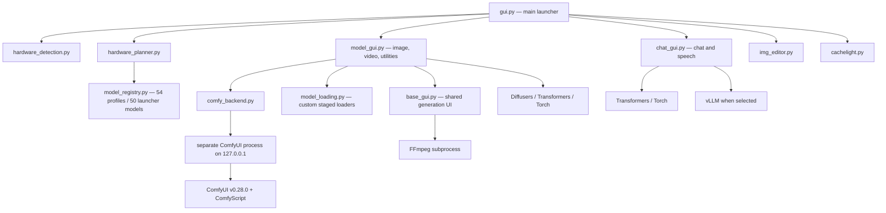
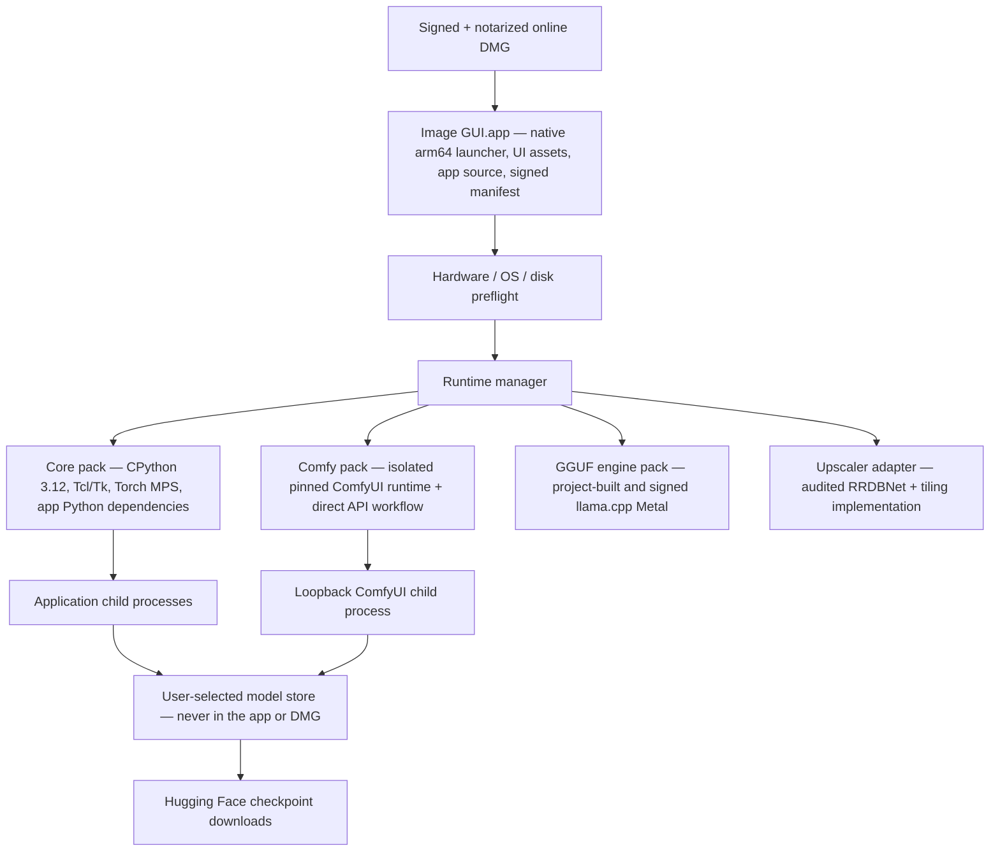

# macOS Apple Silicon release assessment

**Assessment date:** 3 October 2026

**Repository target:** Image-GUI / Local AI Workstation

**Release target:** native macOS on Apple Silicon. M1 through M5 are the fixed certification scope for release 1.0; later Apple Silicon enters through the same qualification gate and is not assumed compatible merely because it is `arm64`.

**Source-development targets retained:** Linux with CUDA and macOS with Metal/MPS

## Executive decision

The packaging design is feasible, but the repository is **not yet proven release-ready on Apple Silicon**. There are three different claims and they must not be conflated:

- **Packaging feasibility — high confidence:** Apple supports Developer ID distribution in a notarized DMG, CPython and the core Python graph have native `arm64` artifacts, and the application can own downloaded, signed runtime packs.
- **Core dependency availability — demonstrated at metadata/resolver level:** a coherent Python 3.12/macOS `arm64` core graph can be resolved entirely from binary artifacts when the Torch family is pinned.
- **All-model runtime compatibility — not yet demonstrated:** no physical M1–M5 model-by-model run has been performed in this Linux audit environment. The current planner simulations are not evidence that a pipeline's MPS operators work.

Consequently, the correct decision is **proceed with the macOS release engineering work, but do not advertise “all models work on Apple Silicon” until the physical-device acceptance ledger is complete**.

The recommended release is a **hybrid, online-first DMG**:

1. Ship a small, signed and notarized native `arm64` `.app` inside a DMG.
2. Give that app ownership of a pinned CPython 3.12 runtime. Do not use or modify a system, Homebrew, Conda, or user-installed Python.
3. On first launch, download signed, versioned dependency packs selected for macOS and Apple Silicon. Install them under the user's Application Support directory, not inside the signed application bundle.
4. Keep model checkpoints entirely outside every DMG and dependency pack. Download them only when a user selects a model, using a configurable model store with free-space checks, resumable transfers, and cache management.
5. Continue to support Linux/CUDA from source with separate locked dependency manifests. No CUDA library belongs in a macOS artifact.
6. Preserve every model and feature, but finish the two macOS backend gaps and validate every model on physical Macs before calling the release complete.
7. Do not ship nightly wheels, development-channel installers, unverified third-party binaries, live `pip` resolution, or `curl | sh`. Build or mirror every approved artifact in controlled CI, hash it, generate an SBOM, sign it, and distribute it from a project-controlled origin.

This is the middle ground between the three proposals. It provides a “double-click and it works” product without turning the DMG into a many-gigabyte, difficult-to-update dependency snapshot. A second, larger **offline-dependencies DMG** can be generated from the same pinned packs for installations without reliable internet. That artifact would still contain **zero model weights**.

> **Non-negotiable packaging invariant:** model weights are never bundled in the `.app`, DMG, Python runtime, ComfyUI pack, or any other installer artifact. The maintainers report that a fully populated development model store is close to 600 GB. The software must treat models as separately managed user data.

> **Non-negotiable dependency invariant:** “it can be downloaded” is not evidence that it belongs in the product. A release dependency must have an identifiable upstream, a reviewed license, a pinned source or first-party release artifact, reproducible provenance, vulnerability review, and passing tests on the supported Apple GPU/OS matrix. The end-user installer must never resolve arbitrary packages from PyPI or execute a network-fetched install script.

## What “just works” should mean

For this project, “just works” should have a testable definition:

- A user on a supported Apple Silicon Mac downloads one notarized DMG, drags the app to Applications, and launches it without using Terminal.
- The app does not require Xcode, Command Line Tools, Homebrew, Conda, an existing Python, `pip`, FFmpeg, or a separately installed PortAudio.
- First launch clearly states the dependency download size, required free space, selected install location, and network requirement.
- Dependency downloads can pause, resume, retry, verify their integrity, and roll back after a failed update.
- The launcher detects native `arm64`, macOS version, unified memory, and free disk space before downloading or loading anything expensive.
- The app launches on all supported memory configurations. Models that cannot fit show an explanation before downloading or loading, rather than crashing or swapping indefinitely.
- Every advertised model remains present. “All models work” means each model has a validated Mac execution path on an appropriate hardware tier; it cannot mean an 80B model must run locally on an 8 GB M1.
- Model checkpoints are downloaded separately and may be stored on an external volume selected by the user.
- Application updates do not invalidate or duplicate the model store.
- Linux/CUDA source installation keeps working independently of the macOS distributable.

## Current system inventory

### Repository and installed footprint

The tracked repository is small: 31 tracked files and approximately 1.1 MB at the time of this audit. The local Linux development installation is not:

| Item | Observed size | Purpose |
|---|---:|---|
| Tracked application source | ~1.1 MB | Launcher, GUIs, planner, installer, tests |
| Main `.venv` | 8.8 GB | Application, model frameworks, CUDA/vLLM on this machine |
| Comfy `.comfy_venv` | 6.2 GB | Isolated ComfyUI runtime |
| Pinned ComfyUI source | ~60 MB | Managed ComfyUI v0.28.0 checkout |
| Model checkpoints | Not part of the repository | Reported near 600 GB when the full local catalogue is populated |

The two Linux environments contain 261 and 141 installed distributions respectively. Major contributors on this machine include two ~1.2 GB Torch installations, 5.7 GB of duplicated NVIDIA packages, 1.3 GB of duplicated Triton, and a 754 MB vLLM install. These Linux numbers **must not be used as an estimate of the Mac artifact**: CUDA, NVIDIA, and Linux Triton payloads are irrelevant to Apple Silicon. The Mac size must be measured from a clean native Mac build.

### Runtime process tree



The launcher deliberately starts model windows in child processes. That is a useful release property: failed model loads and accelerator out-of-memory retries do not need to poison the main launcher process.

### Dependency tree

The direct requirements are currently unpinned, so the transitive graph is not reproducible. The following is the effective architectural tree rather than a claim that every transitive wheel is listed.

```text
Image-GUI
├── App shell and UI
│   ├── CPython + standard library (tkinter, venv, urllib, subprocess, sqlite)
│   ├── Tcl/Tk
│   ├── customtkinter
│   ├── Pillow
│   ├── python-dotenv
│   └── cryptography
├── Core ML runtime
│   ├── torch
│   ├── torchvision
│   ├── torchaudio (declared; no direct application import found)
│   ├── transformers
│   │   ├── huggingface-hub
│   │   ├── tokenizers (transitive)
│   │   ├── safetensors
│   │   ├── sentencepiece
│   │   └── protobuf
│   ├── diffusers
│   │   └── accelerate
│   ├── bitsandbytes
│   ├── peft
│   ├── timm
│   └── einops
├── Numerical and media runtime
│   ├── numpy
│   ├── scipy
│   ├── matplotlib
│   ├── opencv-python
│   ├── imageio
│   ├── imageio-ffmpeg
│   │   └── packaged platform FFmpeg binary in a normal PyPI wheel
│   └── av / FFmpeg libraries contained in its wheel
├── System integration
│   ├── psutil
│   ├── sounddevice
│   │   └── PortAudio dylib contained in the macOS PyPI wheel
│   └── nvidia-ml-py / NVML (Linux CUDA only in practice)
├── Separately installed legacy upscaler
│   ├── BasicSR 1.4.2 source archive
│   ├── realesrgan 0.3.0
│   ├── facexlib (declared upstream, currently absent locally)
│   └── gfpgan (declared upstream, currently absent locally)
├── Managed ComfyUI path used by Anima
│   ├── separate CPython environment
│   ├── ComfyUI v0.28.0 source
│   ├── separate torch / torchvision / torchaudio
│   ├── aiohttp, SQLAlchemy, Alembic, Pydantic, PyYAML, OpenGL, etc.
│   ├── Comfy frontend, workflow templates, embedded docs, kitchen and aimdo
│   └── comfy-script[default] in both Python environments
└── Optional chat engine
    ├── Linux: vLLM + CUDA/Triton
    └── macOS: project-built llama.cpp + Metal for the official GGUF
```

The source manifests are:

- [`requirements.txt`](../requirements.txt): 24 shared direct dependencies.
- [`requirements-macos.txt`](../requirements-macos.txt): Torch, TorchVision, TorchAudio, and BitsAndBytes.
- [`requirements-cuda.txt`](../requirements-cuda.txt): the CUDA development backend.
- [`requirements-cpu.txt`](../requirements-cpu.txt): the CPU development backend.
- [`requirements-vllm.txt`](../requirements-vllm.txt): optional vLLM, enabled only for Linux/CUDA by the installer.
- `runtime/ComfyUI/requirements.txt`: not tracked because `runtime/` is ignored, but downloaded by [`install.py`](../install.py) from the pinned ComfyUI release.

Observed versions in the current Linux main environment include Python 3.14, Torch 2.11.0, TorchVision 0.26.0, TorchAudio 2.11.0, Transformers 5.14.1, Diffusers 0.39.0, BitsAndBytes 0.50.0, vLLM 0.26.0, and ComfyScript 0.6.1. The Comfy environment has already drifted to Torch 2.13.0, TorchVision 0.28.0, and TorchAudio 2.11.0. This illustrates why open-ended requirements cannot be a release mechanism.

TensorFlow, JAX, Core ML, and MLX are **not** dependencies of the current application. They should not be added to a Mac pack merely because they exist on Apple Silicon. MLX is relevant only as a possible replacement backend for particular language-model paths; it is not required for the existing PyTorch/Diffusers application.

### Direct-manifest disposition

This table accounts for every top-level name in the five first-party requirements files. “No direct import” means no tracked application module imports it; it may still be needed by an executed upstream model path, which must be demonstrated before removing it from the resolved graph.

| Declared dependency | Direct use found | macOS release disposition |
|---|---|---|
| `customtkinter` | All three main GUI surfaces | Keep and lock; pure-Python UI dependency |
| `python-dotenv` | Launcher, chat, and model GUI configuration | Keep for release 1.0 or replace later with an app-owned settings layer; no Mac blocker |
| Pillow | GUI assets and image I/O/editing | Keep and lock; exercise its native codecs in signing/import tests |
| `cryptography` | AES-GCM for chat/secrets | Keep; use an upstream stable wheel or project build and sign its native extension |
| NumPy | Directly and throughout ML/media dependencies | Keep as core numerical ABI; pin against SciPy/Torch/media wheels |
| `opencv-python` | Image editor, previews, colour conversion, saliency, Haar cascades, upscaler conversion | Replace most call sites; project-build official OpenCV/Contrib only if the remainder justifies it |
| Matplotlib | Chat audio waveform rendering only | Strong removal candidate: draw the waveform with Tk Canvas or Pillow and eliminate a large plotting stack |
| Transformers | Chat, segmentation, multimodal and staged loaders | Keep; lazy-import per adapter and qualify each architecture on MPS |
| Accelerate | No direct import; required by model frameworks/loaders | Keep in the resolved ML graph where upstream metadata/tests require it; need not remain a hand-maintained universal direct requirement |
| Diffusers | Image/video/upscale pipelines | Keep; largest model-specific API compatibility surface, so lazy-import and pin tightly |
| Hugging Face Hub | Direct checkpoint downloads | Keep as model-store transport; pin code revisions and keep weights outside packs |
| Safetensors | No direct module import; dominant checkpoint format | Keep in ML resolution and validate native extension/import; do not confuse library code with model weights |
| SentencePiece | No direct import; tokenizer backend for selected models | Keep only in packs whose tested tokenizers require it |
| Protobuf | No direct import | Remove from universal direct inputs; allow the lock resolver to include the tested compatible version where required |
| `psutil` | Unified/host-memory detection | Keep for release 1.0; compare its readings with native macOS APIs during planner qualification |
| SoundDevice | Microphone capture | Keep in an audio feature boundary; lazy-load and bind to project-built/signed PortAudio |
| SciPy | No direct import | Remove from universal direct inputs if model-adapter and transitive tests remain green; otherwise lock only where required |
| Einops | No direct import | Treat as model/framework transitive or adapter-specific, not an unconditional application dependency |
| `timm` | No direct import | Treat as model/remote-code-specific; pin only for the exact audited model path that proves it needs it |
| ImageIO | No direct import | Remove from direct inputs after video export tests establish whether Diffusers needs it transitively |
| `imageio-ffmpeg` | No direct API call; application currently searches `PATH` | Remove after routing all subprocess work to the one project-built/signed FFmpeg binary |
| PyAV | No direct import in tracked code | Retain only if executed video pipelines require it; use its frozen native libraries or a project build consistently with the FFmpeg policy |
| PEFT | No direct import | Model/framework-specific; retain through the tested lock only where a loader needs adapters |
| `nvidia-ml-py` | Eager NVML imports in shared base GUI | Move exclusively to Linux/CUDA and lazy-load; exclude from every Mac artifact |
| Torch | Core tensor and model runtime | Keep one stable, hash-locked family; MPS is the Mac accelerator and CUDA remains in separate Linux locks |
| TorchVision | Indirect/legacy upscaler and model ecosystem | Keep only where the tested graph needs it; exact version must match Torch |
| TorchAudio | No direct application import | Keep only if Comfy/model execution proves it is required; exact version must match Torch |
| BitsAndBytes | Quantization configured by chat/model loaders | Provisional Mac component; no dynamic Hub kernels and no release promise until each configuration passes |
| vLLM | Optional Linux chat engine | Linux/CUDA only. Exclude from Mac and use project-built `llama.cpp` solely for the GGUF Mac path |

The low-risk slimming opportunities are therefore Matplotlib, unconditional Protobuf/SciPy/Einops/timm/ImageIO/PyAV/PEFT declarations, duplicate FFmpeg delivery, ComfyScript, and NVIDIA telemetry on Mac. Removing a name from the direct manifest does not necessarily remove it from a feature-specific lock; the executed adapter graph decides that.

### Target-aware macOS dependency resolution performed for this audit

The repository was resolved as Python 3.12 for `aarch64-apple-darwin` with a macOS 15 deployment target and source builds disabled. This was performed from Linux, so it tests package metadata and artifact availability; it does not execute Mach-O code or MPS kernels.

The successful core experiment used `uv 0.12.22` with the following shape; the Comfy experiment added its pinned requirements and the narrow ComfyScript runtime input:

```shell
uv pip compile requirements-macos.txt requirements.txt \
  --python-version 3.12 \
  --python-platform aarch64-apple-darwin \
  --no-build \
  --generate-hashes \
  --constraints production-candidate-constraints.txt
```

The generated candidate locks were intentionally not committed as release locks. They demonstrate that a wheel-only graph can exist, but freezing them before native execution, license/provenance review, and model tests would falsely turn an audit experiment into a supported configuration.

| Resolution experiment | Result | Meaning |
|---|---|---|
| Current unpinned `requirements-macos.txt` + `requirements.txt` | 72 packages resolve, but to Torch 2.14.1, TorchVision 0.29.1, and TorchAudio 2.11.0 | The manifests are unsafe: a fresh install can select an incoherent Torch family even though resolution succeeds |
| Same inputs constrained to Torch 2.11.0, TorchVision 0.26.0, TorchAudio 2.11.0, BitsAndBytes 0.50.0, Transformers 5.14.1, Diffusers 0.39.0, and Accelerate 1.14.0 | 72 packages resolve with hashes and no source build | A coherent core artifact graph is available for the target; it is a candidate lock, not a certified release lock |
| Candidate core + ComfyUI v0.28.0 requirements + `comfy-script[runtime]==0.6.1` | 115 packages resolve with hashes and no source build | The isolated Comfy environment is artifact-feasible, but the Anima workflow still needs an actual MPS run |
| `realesrgan==0.3.0` with source builds disabled | Fails: Real-ESRGAN requires BasicSR 1.4.2 and BasicSR has no usable wheel | The current Real-ESRGAN chain is not a binary-only Mac release path and must not build itself on a user's Mac |

The current installer uses `comfy-script[default]`, not the narrower `runtime` extra. That default extra pulls optional third-party node packages even though the application starts ComfyUI with `--disable-all-custom-nodes`. The application only uses a small core-node workflow. Replace ComfyScript with a first-party client for ComfyUI's prompt/history/view API, or at minimum use and lock the narrow runtime extra after provenance review. Direct API integration is preferred because it eliminates an unnecessary transitive trust surface.

The pinned candidate above is deliberately conservative and aligned to the exact Torch family already working in the Linux main environment and to Apple's current stable PyTorch 2.11 guidance. Final versions must be selected by the Apple Silicon acceptance runs, not by “latest wins.”

### External code, data, services, and operating-system facilities

| External dependency | Used for | Current acquisition | Release treatment |
|---|---|---|---|
| Hugging Face Hub | All model checkpoints; some config/tokenizer files; remote code for BRIA | Downloaded at model load | Retain for model data, but pin revisions and support resumable downloads |
| GitHub / Comfy-Org | ComfyUI v0.28.0 source | Installer downloads a tag archive | Put the audited source/dependencies in a signed Comfy pack or verify a pinned archive hash |
| GitHub / XPixelGroup | BasicSR 1.4.2 source | Installer downloads and locally patches a tag archive | Remove this acquisition path; replace the package chain with a first-party adapter or maintain a reviewed project fork built only in CI |
| GitHub / xinntao Real-ESRGAN release | RealESRGAN_x4plus checkpoint | Code currently downloads a Hugging Face mirror | Preserve the model but acquire the original upstream release asset, verify and record its hash, then place it in the separate model store—not a dependency pack |
| PyPI | Every Python dependency today | Live `pip install` during setup | Replace in releases with prebuilt, locked, signed runtime archives |
| Metal / MPS / Accelerate | Apple GPU and numerical acceleration | Supplied by macOS | Detect OS support; do not download GPU drivers |
| CoreAudio / microphone permission | Voice input | macOS plus SoundDevice/PortAudio | Bundle the wheel payload and add `NSMicrophoneUsageDescription` |
| FFmpeg | Video preview/processing | Code searches `PATH`, despite declaring `imageio-ffmpeg` | Resolve the packaged executable explicitly and sign it |
| Local HTTP on `127.0.0.1` | ComfyUI API | Spawned by the app | Bind loopback only, use an ephemeral port, and stop it reliably |
| Developer ID / Apple notary service | Gatekeeper trust | Not implemented | Required release infrastructure |

`imageio-ffmpeg` publishes platform wheels containing FFmpeg and exposes `get_ffmpeg_exe()`, and SoundDevice's macOS wheel contains PortAudio. Those facts prove that Homebrew is unnecessary, but they do not by themselves satisfy the production provenance policy. The stronger release path is to build FFmpeg and PortAudio from pinned official source in controlled Apple Silicon CI, build the Python bindings against those libraries where necessary, sign the resulting Mach-O payloads, and ship the exact tested outputs. Sources: [imageio-ffmpeg](https://github.com/imageio/imageio-ffmpeg), [SoundDevice installation](https://python-sounddevice.readthedocs.io/en/0.5.5/installation.html), [FFmpeg](https://ffmpeg.org/), and [PortAudio](https://www.portaudio.com/).

The Real-ESRGAN authors publish `RealESRGAN_x4plus.pth` in the project's own [v0.1.0 release](https://github.com/xinntao/Real-ESRGAN/releases/tag/v0.1.0). The current Hugging Face mirror is unnecessary. Switching the download origin after hash/output verification improves provenance without changing or bundling the model.

### Dependency admission and provenance policy

The project should classify dependencies before they enter a signed pack:

| Class | Examples | Release rule |
|---|---|---|
| Platform/vendor supported | macOS Metal/MPS/Accelerate/CoreAudio; stable CPython; stable PyTorch family; Apple MLX if later justified | Allowed after exact-version locking and project tests; use stable releases only |
| Established upstream library | Transformers, Diffusers, NumPy, SciPy, Pillow, cryptography, PyAV, FFmpeg, PortAudio, ComfyUI, `llama.cpp` | Use an upstream release/tag or exact reviewed commit; consume first-party wheels where policy permits, otherwise build from official source in CI; mirror, hash, scan, sign, and record in the SBOM |
| Small pure-Python UI/application package | CustomTkinter, python-dotenv, PEFT, timm, einops | Lock exact source/artifact hashes and vendor or mirror after license and maintainer review; no live index resolution |
| Provisional accelerator | BitsAndBytes MPS | Not part of the production promise until every quantized model path passes on Apple GPU families 7–10 and macOS versions in scope; retain a non-BnB plan where feasible |
| Rejected release mechanism | nightlies, continuous wheels, development channels, unsigned GitHub binaries, `curl | sh`, community model conversions, mutable branch archives, live PyPI installs | Never execute or fetch on an end-user machine |

This policy distinguishes an open-source dependency from an untrusted binary. A mature upstream such as `llama.cpp` can be acceptable when the project builds a pinned release from source and signs the output. A random wheel or model conversion uploaded by an unrelated account is not acceptable merely because its filename matches the platform.

## Current portability and release blockers

### Blockers to creating a deterministic artifact

1. **Every first-party requirements file is effectively unlocked.** A build tomorrow can resolve a different Torch, Transformers, Diffusers, ComfyUI transitive graph, or native wheel set.
2. **The existing virtual environments are not portable.** The current `.venv` is a Linux `x86_64` environment whose interpreter symlink targets `/usr/bin/python`; it cannot be copied into a Mac app.
3. **The current installer performs live builds and live dependency resolution.** That can fail because of network state, deleted wheels, changed metadata, compilers, or an upstream compromise.
4. **Application state is rooted beside `__file__`.** [`app_config.py`](../app_config.py), [`comfy_backend.py`](../comfy_backend.py), media defaults, `.env`, and chat history assume the source tree is writable. A signed app bundle should be treated as immutable.
5. **There is no distributable application license.** The only tracked license file is `CACHELITE_LICENSE`. Before distributing the app or ComfyUI, the project needs its own license decision, a third-party notices file, and an SBOM. The downloaded ComfyUI v0.28.0 source is GPL-3.0, which requires a deliberate compliance review.

### macOS code blockers

| Finding | Evidence | Required change |
|---|---|---|
| Linux-only folder opening | `xdg-open` is hard-coded in [`base_gui.py`](../base_gui.py) and [`img_editor.py`](../img_editor.py) | Use `open` on macOS or a small cross-platform helper |
| NVIDIA dependency loaded in shared UI | [`base_gui.py`](../base_gui.py) imports `pynvml` at module import time | Move NVML and `nvidia-ml-py` into the Linux/CUDA extra and lazy-load it only on CUDA |
| All image/video pipeline classes imported eagerly | [`model_gui.py`](../model_gui.py) and [`model_loading.py`](../model_loading.py) import a large, version-sensitive Diffusers/Transformers surface at startup | Lazy-import per model so one unavailable class disables one model, not the entire image application |
| `flex_attention` imported eagerly | Both model modules import `torch.nn.attention.flex_attention` before a model is selected | Capability-check it and provide the model-specific MPS path |
| Audio imported eagerly | [`chat_gui.py`](../chat_gui.py) imports SoundDevice at startup | Lazy-load microphone support and present a permission/device error without disabling chat |
| FFmpeg searched only on `PATH` in key paths | [`base_gui.py`](../base_gui.py) and [`gui.py`](../gui.py) use `shutil.which("ffmpeg")` | Use a signed helper built from pinned official FFmpeg source; never depend on Homebrew or the user's `PATH` |
| OpenCV feature/package and provenance mismatch | [`img_editor.py`](../img_editor.py) uses `cv2.saliency`, but the manifest declares the non-contrib `opencv-python` wheel; the PyPI wheel is not built by the OpenCV project itself | Prefer replacing simple color/video operations with NumPy/Pillow/PyAV and the saliency/face-detection features with an audited implementation; otherwise build a minimal OpenCV/Contrib wheel from official source in project CI and sign it |
| Remote Python execution | BRIA uses `trust_remote_code=True` without a pinned revision | Pin an audited commit and include its source/hash in the release manifest |
| Real-ESRGAN chain cannot be binary-only | `pip check` reports missing `facexlib` and `gfpgan`; the installer patches BasicSR source; a target-aware no-build resolution fails because BasicSR 1.4.2 has no wheel; the code fetches the x4plus checkpoint from a mirror instead of the author release | Replace the stale package chain with an audited, self-contained RRDBNet/tiling adapter for the same x4plus model, source the unchanged checkpoint from the upstream Real-ESRGAN release, or build a complete reviewed fork in CI; never patch/build it during user setup |
| ComfyScript default extra is broader than the feature | It is installed into both environments and pulls optional node packages while custom nodes are disabled | Replace it with a small direct ComfyUI API client and a versioned workflow JSON |
| Torch family can resolve inconsistently | The unpinned Mac graph selected Torch 2.14.1 with TorchAudio 2.11.0 during this audit | Install one hash-locked, tested Torch/TorchVision/TorchAudio family in one transaction |
| Validation scans generated environments | [`validate_project.py`](../validate_project.py) recursively compiles the repository and enters `.venv`, failing on unrelated third-party source | Restrict validation to tracked first-party files |

### Model-path blockers

The registry contains 50 launcher-visible models and 54 profiles including auxiliary/runtime artifacts. The planner can synthesize MPS candidates for most entries, but that is not the same as executing the model on a Mac.

Two launcher models currently have **no MPS-ready plan at any simulated memory size**:

- **Real-ESRGAN x4plus:** the current `RealESRGANer` path is marked CUDA-only. Implement and validate MPS or CPU fallback while retaining the same model and result semantics.
- **Qwen3 Coder Next 80B Q4_K_M:** the application currently routes the GGUF model through vLLM, while [`install.py`](../install.py) explicitly disables vLLM on macOS. Add a Mac adapter that launches a project-built and signed `llama.cpp` Metal server or links its library, using the same official Qwen Q4_K_M GGUF checkpoint. This preserves the model while replacing only its Mac execution engine.

`vllm-metal` is **not recommended for the release 1.0 trust base**. It is part of the vLLM project, but its own installation page says ordinary `pip install vllm-metal` is unsupported, directs users to pipe a network script into a shell, and makes the development channel the default. Its feature page labels paged attention experimental. Those are useful prototype characteristics, not the deterministic release mechanism requested here. See the [vLLM Metal installation page](https://docs.vllm.ai/projects/vllm-metal/en/stable/installation/) and [feature overview](https://docs.vllm.ai/projects/vllm-metal/en/stable/).

The preferred path is `llama.cpp` built by this project from a pinned upstream release/commit on Apple Silicon CI, with Metal enabled, then signed and placed in the GGUF engine pack. The official Qwen model card explicitly documents `llama.cpp` for `Qwen/Qwen3-Coder-Next-GGUF:Q4_K_M`, and `llama.cpp` contains the `QWEN3NEXT` architecture and Qwen3-Coder-Next test schema. Use the official Qwen-published GGUF shards, not a community conversion. Sources: [`llama.cpp`](https://github.com/ggml-org/llama.cpp) and the [official Qwen3-Coder-Next GGUF model card](https://huggingface.co/Qwen/Qwen3-Coder-Next-GGUF).

Additional risks requiring physical-Mac inference tests are:

- Most Diffusers image and video profiles are explicitly marked `pipeline_dependent_and_unverified` for MPS.
- Anima depends on a separately launched, currently unvalidated Mac ComfyUI stack and three separately obtained checkpoints.
- Several loaders use model-specific staging, BitsAndBytes quantization, FP8 artifacts, or operations that may differ on MPS.
- MPS does not imply that every PyTorch operator used by every upstream pipeline has an implemented, numerically acceptable Metal path.
- Hugging Face's MPS guidance warns that memory pressure and swapping materially damage inference performance, especially below 64 GB; pipeline-specific memory techniques still need validation. See [Diffusers on MPS](https://huggingface.co/docs/diffusers/v0.30.2/optimization/mps).

## Apple Silicon support analysis

### Scope lock: native Apple Silicon, not generic macOS

M1 through M5 share the AArch64 application ABI, so one native `arm64` launcher/runtime can span them. That proves only CPU binary compatibility. It does **not** prove that a model's operators, precision, memory use, or sustained performance work across all Macs.

Apple's May 2026 Metal feature tables map the chips to four GPU capability families:

| Apple chip generation | Metal GPU family | Metal programming model | Release implication |
|---|---|---|---|
| M1 series | Apple7 | Metal 3 and Metal 4 | Oldest GPU family in scope; mandatory compatibility floor |
| M2 series | Apple8 | Metal 3 and Metal 4 | Separate kernel/feature family; mandatory test target |
| M3 and M4 series | Apple9 | Metal 3 and Metal 4 | Same advertised GPU family, but both generations still need performance/memory validation |
| M5 series | Apple10 | Metal 3 and Metal 4 | Newest fixed-scope family; mandatory test target |

Apple states that PyTorch's MPS path uses MPS Graph and kernels tuned for the characteristics of each Metal GPU family. Therefore, a single `arm64` wheel is sensible, while Apple7/8/9/10 are separate runtime qualification targets. The primary source is Apple's [Metal Feature Set Tables](https://developer.apple.com/metal/Metal-Feature-Set-Tables.pdf); Apple's [PyTorch on Metal page](https://developer.apple.com/metal/pytorch/) describes the family-tuned MPS kernel path.

No CUDA runtime or GPU driver should be shipped for macOS. Metal, MPS, MPSGraph, and the device driver are OS components. This also means macOS build number is part of the inference environment: the same M1 can gain fixes or regressions when the OS-supplied framework changes.

### M1–M5 Mac inventory

Apple's retail catalogue is small enough to inventory, but “model” can mean a shell, a chip option, a screen size, or a model identifier. For release planning, the useful unit is a **hardware qualification group**: product generation plus cooling/form-factor class. This is not a claim that Pro, Max, and Ultra have equivalent performance; memory capacity, bandwidth, and chip tier remain sub-boundaries inside each group. Screen sizes and port-count variants are grouped when they do not introduce a release-relevant software boundary.

| Product line | M1–M5 hardware qualification groups | Count |
|---|---|---:|
| MacBook Air | M1 13-inch; M2 13/15-inch; M3 13/15-inch; M4 13/15-inch; M5 13/15-inch | 5 |
| MacBook Pro | M1 13-inch; M1 Pro/Max 14/16-inch; M2 13-inch; M2 Pro/Max 14/16-inch; M3 14-inch; M3 Pro/Max 14/16-inch; M4 14-inch; M4 Pro/Max 14/16-inch; M5 14-inch; M5 Pro/Max 14/16-inch | 10 |
| iMac 24-inch | M1; M3; M4. Two-port/four-port variants are one compute group per chip | 3 |
| Mac mini | M1; M2/M2 Pro; M4/M4 Pro; M5 Pro | 4 |
| Mac Studio | M1 Max/Ultra; M2 Max/Ultra; M4 Max/M3 Ultra; M5 Max/Ultra | 4 |
| Mac Pro | M2 Ultra tower/rack; both use model identifier Mac14,8 | 1 |
| **Total** | **M1–M5 product/form-factor qualification groups** | **27** |

This is why exhaustive compatibility is tractable without buying every SKU. The release lab does not need every colour, SSD size, port variant, or screen size. It does need every Metal GPU family, low and high unified-memory boundaries, a fanless Air, an actively cooled laptop, and desktop Max/Ultra coverage.

Apple's identification pages support this inventory: [MacBook Air](https://support.apple.com/en-gb/102869), [MacBook Pro](https://support.apple.com/en-lamr/108052), [iMac](https://support.apple.com/en-us/108054), [Mac mini](https://support.apple.com/en-ie/102852), [Mac Studio](https://support.apple.com/en-ie/102231), and [Mac Pro](https://support.apple.com/en-us/102887). At the assessment date Apple also lists an M6 Mac mini. It is in the user's “or newer” direction but outside the fixed M1–M5 evidence set; admit M6 and later only after architecture, OS, Metal-family, dependency, and model tests pass.

### Unified-memory and bandwidth envelope

Capacity controls whether a model can load. Bandwidth, GPU cores, cooling, and power envelope control whether it is usable. The upper capacities and published bandwidth range vary substantially even inside one generation:

| Generation | Base max | Pro max | Max max | Ultra max | Published family bandwidth span | Qualification consequence |
|---|---:|---:|---:|---:|---:|---|
| M1 / Apple7 | 16 GB | 32 GB | 64 GB | 128 GB | about 68–800 GB/s | Includes 8 GB fanless Macs and the oldest MPS family |
| M2 / Apple8 | 24 GB | 32 GB | 96 GB | 192 GB | 100–800 GB/s | Adds important 24 GB and 96 GB boundaries |
| M3 / Apple9 | 24 GB | 36 GB | 128 GB | 512 GB | 100 to over 800 GB/s | The Ultra has far more capacity than any M3 laptop; neither represents the other |
| M4 / Apple9 | 32 GB | 64 GB | 128 GB | — | 120–546 GB/s | Shares Apple9 with M3 but not its memory/performance profile |
| M5 / Apple10 | 32 GB | 64 GB | 128 GB | 512 GB | 153 GB/s–1.2 TB/s | New GPU family and the widest current desktop range |

Primary Apple sources: [M1](https://www.apple.com/newsroom/2020/11/apple-unleashes-m1/), [M1 Pro/Max](https://www.apple.com/newsroom/2021/10/apple-unveils-game-changing-macbook-pro/), [M1 Ultra](https://www.apple.com/newsroom/2022/03/apple-unveils-m1-ultra-the-worlds-most-powerful-chip-for-a-personal-computer/), [M2](https://www.apple.com/newsroom/2022/06/apple-unveils-m2-with-breakthrough-performance-and-capabilities/), [M2 Pro/Max](https://www.apple.com/newsroom/2023/01/apple-unveils-m2-pro-and-m2-max-next-generation-chips-for-next-level-workflows/), [M2 Ultra](https://www.apple.com/newsroom/2023/06/apple-introduces-m2-ultra/), [M3 family](https://www.apple.com/newsroom/2023/10/apple-unveils-m3-m3-pro-and-m3-max-the-most-advanced-chips-for-a-personal-computer/), [M3 Ultra](https://www.apple.com/newsroom/2025/03/apple-unveils-new-mac-studio-the-most-powerful-mac-ever/), [M4 Pro/Max](https://www.apple.com/sg/newsroom/2024/10/apple-introduces-m4-pro-and-m4-max/), [M5](https://www.apple.com/newsroom/2025/10/apple-unleashes-m5-the-next-big-leap-in-ai-performance-for-apple-silicon/), [M5 Pro/Max](https://www.apple.com/newsroom/2026/03/apple-debuts-m5-pro-and-m5-max-to-supercharge-the-most-demanding-pro-workflows/), and [M5 Max/Ultra Mac Studio specifications](https://support.apple.com/en-sg/128107).

### Framework feasibility and production status

| Layer | Official evidence | Production verdict |
|---|---|---|
| PyTorch 2.11 MPS | Apple documents the stable 2.11 release for Apple Silicon, macOS 14+, and Python 3.10+, but explicitly labels the MPS backend beta | Use only the stable release family, never nightly; certify each model/operator path and retain tested CPU fallback where correct |
| Transformers | Official docs say MPS lacks some PyTorch operations and `PYTORCH_ENABLE_MPS_FALLBACK=1` may be needed; whole-model placement generally must fit unified memory | Supported framework, not blanket model proof; test each architecture, precision, tokenizer/processor, generation mode, and fallback path |
| Diffusers | Official MPS path exists, but docs warn about memory pressure, swap, batching failures, and attention slicing below 64 GB | Keep it; validate all 24 Diffusers-format launcher models at actual resolution/frame defaults rather than extrapolating from Stable Diffusion |
| BitsAndBytes 0.50 | Official upstream release says all 4-bit and LLM.int8 configurations now work on MPS; optimized Metal kernels require macOS 26+ and a separate Hub-delivered `kernels` package, while older systems use a naive fallback | Provisional on Mac. Dynamic Hub kernel downloads are prohibited. Test the self-contained fallback first; admit optimized kernels only if their exact source and build become reviewable, frozen pack inputs. Otherwise replace the affected quantization path with a model-supported stable alternative |
| ComfyUI v0.28 | Official Comfy source and its dependencies resolve for macOS arm64 | Artifact-feasible, but only the real Anima workflow proves product support; use direct API integration and no third-party custom nodes |
| `llama.cpp` | Upstream supports Metal and QWEN3NEXT; the official Qwen GGUF card documents it | Preferred Mac GGUF engine when built from pinned source and signed by this project; still requires exact-model tests |
| `vllm-metal` | vLLM project plugin with macOS 15/arm64/Python 3.12 wheels, nonstandard script install, development default, and experimental features | Prototype only; rejected from release 1.0's production trust base |
| MLX / MLX-LM | Apple-maintained framework and a plausible language-model alternative | Not required by the current app. Consider only if a tested model path cannot meet the release bar with PyTorch MPS or `llama.cpp`; do not use community-converted weights as a shortcut |

Sources: [Apple PyTorch/MPS](https://developer.apple.com/metal/pytorch/), [Transformers on Apple Silicon](https://huggingface.co/docs/transformers/perf_train_special), [Diffusers on MPS](https://huggingface.co/docs/diffusers/v0.30.2/optimization/mps), [BitsAndBytes releases](https://github.com/bitsandbytes-foundation/bitsandbytes/releases), [`llama.cpp`](https://github.com/ggml-org/llama.cpp), and [MLX](https://github.com/ml-explore/mlx).

### Recommended product floor and OS policy

- **Architecture:** Apple Silicon only, native `arm64`; reject Intel and reject launch under Rosetta. A larger `universal2` build would add an untested architecture with no product benefit.
- **Deployment target:** macOS 15 for the binary and the oldest M1–M4 test lane. M5 machines cannot necessarily be downgraded to macOS 15 because Macs do not support installing a macOS version older than the one they shipped with; test each M5 on its factory-supported minimum and on the current macOS release.
- **Memory:** the app shell should launch on 8 GB; 16 GB is the sensible public minimum for useful small-model coverage. The official Qwen Q4_K_M checkpoint is approximately 48.4 GB before KV cache and application/OS headroom, so 64 GB is a test boundary, not a guarantee; 96 GB or more is the safer full-catalogue validation tier until measurements prove otherwise.
- **Disk:** require enough free space for the selected dependency pack plus temporary extraction headroom, then check the separate model store before every checkpoint download. Do not advertise one fixed disk requirement for a catalogue approaching 600 GB.
- **Python:** one app-owned CPython 3.12 `arm64` patch release per application release. Never use system, Homebrew, Conda, or Rosetta Python.
- **Build machine:** native Apple Silicon CI or controlled Macs. Linux can resolve metadata and run source tests, but it cannot execute, sign, notarize, or qualify the Mac runtime.

Apple lists M1-era Macs as compatible with macOS 15, so the floor retains the oldest chip generation in scope; see the [macOS Sequoia compatibility list](https://support.apple.com/en-us/120282). The macOS 15 choice narrows the support surface and gives one stable deployment ABI. It is no longer justified by `vllm-metal`, which this report now rejects for production.

### Evidence ledger: what has and has not been proved

| Claim | Evidence obtained | Status |
|---|---|---|
| One native CPU architecture spans M1–M5 | Apple hardware documentation and `arm64` packaging model | Established for application binary compatibility |
| M1–M5 are not one GPU target | Apple maps them to Apple7, Apple8, Apple9, and Apple10 | Established; four Metal-family lanes are mandatory |
| A coherent core dependency graph exists | Target-aware Python 3.12/macOS arm64 no-build resolution: 72 hashed packages with a pinned Torch family | Established at artifact-metadata level only |
| The Comfy dependency graph exists | Target-aware no-build resolution: 115 hashed packages using the narrow ComfyScript runtime extra | Established at artifact-metadata level only; direct API replacement is still preferred |
| Current Real-ESRGAN packaging works | Binary-only target resolution fails at BasicSR; current installer patches source and omits declared deps | Disproved; refactor required |
| Stable PyTorch can address MPS | Apple stable-release documentation and native target artifacts | Established at framework level; operator/model coverage unproved |
| Every one of the 50 launcher models runs | Planner simulations and Linux tests only | **Not proved** |
| The app runs on Apple7/8/9/10 | No physical Mac execution in this audit | **Not proved** |
| DMG signing/notarization works | Apple documents the workflow; no project artifact has been built | Feasible, **not yet executed** |

The release should publish this ledger as generated evidence. A green dependency resolver is not a green model test, and an MPS device probe is not a successful inference.

### Planner-derived memory tiers

The existing planner was run against simulated MPS machines at 8, 16, 24, 32, 36, 48, 64, 96, 128, 192, and 512 GB with MPS BitsAndBytes capability enabled. The first memory size at which it produced a plan was:

| First simulated tier | Launcher models |
|---:|---|
| 8 GB | Z Image Turbo; Kandinsky 5 T2I Lite; Stable Diffusion 3.5 Large; BRIA RMBG; Stable Diffusion x4; GPT-2 Large; Falcon-H1 0.5B; Liquid LFM2.5 1.2B; Qwen3.5 4B; Qwen3.5 9B |
| 16 GB | PixArt Sigma; Anima; FLUX.1; GLM Image; Qwen Image; Kandinsky 5 I2I Lite; ChronoEdit; SkyReels V2; Kandinsky 5 T2V Lite; Cosmos Predict2; Allegro; CogVideoX; Kandinsky 5 I2V Lite; Mistral 7B; Command R7B; Falcon-H1 7B; Llama 3.1 8B; Gemma 2 9B; GLM-4 9B; Falcon3 10B; OLMo 2 13B; Qwen2.5 14B; Phi-4 14B; Qwen3 14B |
| 24 GB | Qwen Image Edit 4-bit; Hunyuan Video 1.5 T2V/I2V; GPT-OSS 20B; Qwen3.6 27B |
| 32 GB | FLUX.2; Kandinsky 5 T2V Pro distilled/SFT; Kandinsky 5 I2V Pro; Qwen2.5 32B; Falcon-H1 34B; DeepSeek R1 Distill Qwen 32B; Gemma 4 31B |
| 48 GB | Qwen3.6 35B A3B |
| No current MPS plan | Real-ESRGAN x4plus; Qwen3 Coder Next 80B GGUF |

These are **planning estimates, not a support matrix**. They do not demonstrate operator compatibility, acceptable speed, successful generation, or sufficient headroom for macOS and the GUI. In particular, the official 80B Q4_K_M GGUF is about 48.4 GB before KV cache and runtime overhead: 64 GB is a boundary test, while 96 GB or more is the provisional full-catalogue target. The real support matrix must be generated from clean physical-device runs and recorded per model, workload, app version, runtime version, chip, RAM, and macOS build.

## Distribution options

All options below exclude model weights.

| Option | User experience | Advantages | Costs and risks | Verdict |
|---|---|---|---|---|
| Dependency-complete DMG | Large download; works without downloading Python packages | Simplest first run; reproducible if signed and locked | Multi-GB likely; duplicate Comfy/Torch runtime; slow updates; every dependency change replaces the DMG | Offer later as a secondary offline artifact |
| Thin source app using system Python | Small DMG; installs packages on first run | Small initial file | Python is not guaranteed, wrong version/architecture is common, live `pip` is nondeterministic, needs build tools | Reject |
| Thin signed bootstrap + owned runtime packs | Small DMG; guided first-run dependency download | “Just works,” deterministic, resumable, updateable, excludes CUDA and unused packs | Requires a runtime manifest/update service and careful signing | **Recommended primary release** |
| Rewrite to remove Python/ML dependencies | Potentially smaller shell | Maximum native integration in the long term | Very high effort, duplicates mature ML stacks, threatens feature/model parity | Reject for release 1.0 |

A dependency-complete DMG does not need CUDA and should not include it “just in case.” CUDA has no execution role on Apple Silicon. Linux CUDA support remains in source manifests and Linux CI.

## Recommended release architecture



### What is in each artifact

| Artifact | Contains | Explicitly excludes |
|---|---|---|
| Online DMG | Native launcher/updater, icons/assets, app source, bootstrap trust keys, initial manifest, licenses/notices | Python environment, CUDA, model checkpoints |
| Core runtime pack | Relocatable CPython 3.12 arm64, Tcl/Tk, core Python wheels, Torch MPS, packaged FFmpeg/PortAudio, frozen lock metadata | CUDA/NVIDIA libraries, model checkpoints, live `pip` resolution |
| Comfy pack | Audited ComfyUI source, isolated locked runtime, and direct API workflow contract | Anima checkpoints, custom-node bundles, ComfyScript default extras, and other model weights |
| GGUF engine pack | Project-built and signed `llama.cpp` Metal engine from pinned source | Qwen checkpoint files and network-fetched install scripts |
| Upscaler pack or core adapter | Audited self-contained RRDBNet/tiling implementation for the existing Real-ESRGAN x4plus model | BasicSR live source patches, unused face-restoration dependencies, and the upstream-sourced checkpoint itself |
| Offline-dependencies DMG | The same launcher plus all dependency packs | Every model checkpoint |

The precise online-DMG and pack sizes should be published only after building them on a clean Mac and recording compressed and installed sizes. The source is negligible; Torch and native ML/media wheels dominate.

### Why system Python is not acceptable

Apple explicitly advised applications that depend on scripting languages to bundle their runtime, and later macOS releases removed the legacy system Python. A Command Line Tools Python is an implementation detail, not an application ABI. See Apple's [macOS Catalina scripting-runtime guidance](https://developer.apple.com/documentation/macos-release-notes/macos-catalina-10_15-release-notes).

Using an existing Python creates failures that the application cannot control:

- Python may be absent, Intel-only under Rosetta, too old, or too new for native wheels.
- The user's packages and environment variables can contaminate resolution.
- Tk/Tcl availability and version differ by distributor.
- Homebrew/Conda locations move and are not owned by the app.
- Uninstalling or upgrading the user's Python can break the application.

The online-first design still avoids placing Python in the small DMG: it downloads an app-owned, pinned CPython runtime on first launch. There should be exactly one supported Python minor version per release, not multiple versions per M-series chip.

### Runtime pack format and installation

Use versioned, content-addressed archives, for example:

```text
manifest-v1.json
├── core-macos15-arm64-py312-<sha256>.tar.zst
├── comfy-macos15-arm64-py312-<sha256>.tar.zst
├── gguf-metal-macos15-arm64-<sha256>.tar.zst
└── upscaler-macos15-arm64-py312-<sha256>.tar.zst
```

Each manifest entry should contain the application version range, exact component versions, architecture, minimum OS, compressed bytes, installed bytes, SHA-256, signature, license-notice reference, and health-check command/result schema.

Installation should:

1. Download to a temporary `.partial` file with range-request resume support.
2. Verify expected length, SHA-256, and an offline-verifiable project signature.
3. Extract to a new versioned directory.
4. Validate architecture, code signatures, imports, MPS availability, and a tiny non-model tensor operation.
5. Atomically switch a `current` pointer or small state file.
6. Keep the previous known-good version for rollback.
7. Never run `pip` against public indexes on an end user's machine.

Every Mach-O executable and dylib in a downloaded pack must be signed, and the distribution container needs an Apple-compatible notarization strategy. The bootstrap's cryptographic signature is an additional supply-chain control; it does not replace Developer ID signing and notarization.

### Packaging technology choice

Two implementation spikes are worthwhile:

1. **Relocatable embedded CPython runtime (preferred):** build CPython 3.12 and all wheels on an Apple Silicon CI runner, place them in a versioned runtime directory, and have the Swift launcher invoke that interpreter against source in the app bundle. This matches optional packs and atomic updates best.
2. **PyInstaller one-folder `.app` (fallback):** PyInstaller supports native `arm64` targets and code signing, but its static analysis needs extensive hooks for this codebase's dynamic model imports, and a monolithic frozen graph makes optional packs and small updates harder. Avoid one-file extraction for multi-gigabyte ML runtimes.

PyInstaller builds for the current platform/architecture and documents Apple Silicon `arm64` and `universal2` behavior; see its [macOS feature notes](https://pyinstaller.org/en/stable/feature-notes.html). Because Intel is out of scope, a larger universal2 artifact offers no benefit.

## Dependency-stack recommendations

### Keep

- CPython, stable PyTorch, Transformers, Diffusers, Accelerate, and Hugging Face Hub. They are the implementation substrate for almost the entire catalogue, have official upstreams, and replacing them wholesale would create more model-parity risk than it removes.
- The MPS/CUDA hardware planner and fresh-process retry model.
- Separate ComfyUI isolation for the first Mac release unless a compatibility study proves a shared environment safe.
- Tk/CustomTkinter for the model application in release 1.0. A native Swift bootstrap is enough; rewriting every GUI is not a packaging prerequisite.
- On-demand checkpoint acquisition and a configurable Hugging Face/model cache.

### Split by platform or feature

- Move `nvidia-ml-py`, vLLM CUDA, NVIDIA packages, and CUDA-specific tooling out of shared requirements.
- Make a project-built `llama.cpp` Metal binary the Mac-only GGUF engine pack. Keep Linux vLLM independent.
- Make ComfyUI a separately versioned, isolated pack even if first-run setup installs it by default.
- Treat BitsAndBytes MPS as a provisional feature pack until exact quantized paths pass. A resolver finding a wheel is not sufficient evidence for a release-critical accelerator.
- Confirm whether TorchAudio is required by the locked Comfy graph. No direct first-party import was found; keep it only in the environment whose executed workflow proves it needs it.
- Put FFmpeg and PortAudio binaries behind app-owned paths. Build them from pinned official source in CI if first-party binary provenance cannot be established to the project's standard.

### Remove, replace, or refuse for release 1.0

| Current dependency/path | Decision | Reason and replacement |
|---|---|---|
| `vllm-metal` | **Do not ship** | Its supported installation is a network shell script, its default channel is development, and some relevant features remain experimental. Use project-built `llama.cpp` Metal for the official Qwen GGUF. Reconsider only after vLLM offers a stable, conventional, reproducible release artifact that passes this project's gates. |
| `comfy-script[default]` | **Remove** | The app disables custom nodes but installs a broad third-party extra in both environments. Submit workflow JSON and query history/results through ComfyUI's direct loopback API. |
| BasicSR 1.4.2 + Real-ESRGAN 0.3.0 installer patch | **Replace** | The graph has no binary-only resolution and is patched during setup. Implement the small RRDBNet/tiling/inference surface needed for the same Real-ESRGAN x4plus model, or maintain a reviewed project fork built in CI. Use the upstream author release for the unchanged checkpoint and do not silently drop the model. |
| `opencv-python` community wheel | **Do not consume as-is** | The code also asks for `cv2.saliency`, which belongs to Contrib rather than the declared wheel. Replace straightforward image/video operations with Pillow, NumPy, or PyAV and audit the remaining algorithms; if OpenCV is still needed, build a minimal OpenCV/Contrib artifact from official source and sign it. |
| Duplicate `imageio-ffmpeg`, PyAV, and PATH FFmpeg paths | **Consolidate** | Select one signed FFmpeg build and one application resolver. Keep PyAV only where its in-process API is used, and remove redundant wrappers after call-site tests. |
| Live PyPI/GitHub installation | **Refuse** | Resolution and compilation happen in release CI, never on an end-user Mac. Runtime packs contain only admitted, hashed, scanned, signed outputs. |

The upscaler change and direct Comfy API integration are dependency-stack redesigns, but they are narrow boundary changes rather than functionality removals. The model identifiers, workflows, checkpoints, and user-visible features remain.

### Artifact source rule

“Available on PyPI” is not an admission criterion. The release build may use PyPI as a transport only when the file is an exact upstream-published stable artifact and its provenance, hash, license, architecture, and contents have been reviewed. Otherwise the project should build from the dependency's official tagged source on controlled Apple Silicon CI. In both cases, the public artifact is copied into an immutable project-controlled build input store; users download only the project's signed runtime pack.

The release therefore has two trust boundaries:

1. **Build-time inputs:** pinned upstream source or upstream-owned stable wheels, verified in CI and retained with provenance.
2. **End-user inputs:** a notarized DMG plus project-signed, content-addressed packs. There is no package resolver, compiler, arbitrary post-install hook, or third-party binary host in the installation path.

### Lock, do not merely pin top-level packages

Create platform-specific, hash-locked manifests from tested environments, for example:

```text
requirements/
├── in/
│   ├── shared.in
│   ├── macos-core.in
│   ├── macos-comfy.in
│   ├── macos-gguf.in
│   ├── linux-cuda.in
│   └── linux-cpu.in
└── locks/
    ├── macos-15-arm64-py312-core.lock
    ├── macos-15-arm64-py312-comfy.lock
    ├── macos-15-arm64-py312-gguf.lock
    ├── linux-x86_64-py312-cuda.lock
    └── linux-x86_64-py312-cpu.lock
```

Every locked entry should include a hash. Build without source distributions unless a specific dependency is intentionally compiled in CI. Record the complete resolver input, Python build, wheel filenames, licenses, and SBOM in the release.

### Lazy loading and failure isolation

Refactor model imports into adapters keyed by registry profile:

```text
model adapter
├── dependency probe
├── lazy imports
├── Mac/CUDA loader selection
├── checkpoint declaration
├── preflight memory/disk requirements
└── smoke-test workload
```

This does not remove functionality. It prevents one newly introduced Diffusers class, audio library, Comfy component, or CUDA-only telemetry package from stopping unrelated models from launching. It also allows the bootstrap to determine exactly which dependency pack is required for a selected model.

## Model storage and download design

The model store deserves first-class product work because it can be two orders of magnitude larger than the application runtime.

### Required behavior

- No model file in any installer artifact.
- Default to an app-managed persistent location, with an explicit option to choose an external SSD before the first model download.
- Reuse the existing Hugging Face cache when the user deliberately selects it, but do not silently depend on environment variables from a shell profile.
- Show model download size, installed size, license/gating status, target volume, and remaining space before starting.
- Keep `.partial` files separate, resume HTTP downloads, verify upstream checksums/ETags where available, and recover from interruption.
- Track references so shared checkpoints/tokenizers are not duplicated and deleting one model does not remove data used by another.
- Provide per-model delete, “reveal in Finder,” move-store, repair, and verify actions.
- Treat the three Anima checkpoints and the Real-ESRGAN checkpoint exactly like every other model asset: separate from code and dependency packs. Migrate the Real-ESRGAN x4plus download from the current mirror to the model author's release asset after verifying that the bytes and expected network are unchanged.
- Never delete a user's model store during application uninstall or runtime rollback without a separate, explicit confirmation.

### Recommended filesystem layout

```text
/Applications/Image GUI.app                         # immutable, signed app
~/Library/Application Support/Image GUI/
├── config/
├── secrets/
├── runtimes/
│   ├── core/<version>/
│   ├── comfy/<version>/
│   ├── gguf/<version>/
│   └── upscaler/<version>/
├── models/                                         # default; user can relocate
├── state/
│   ├── installation.json
│   └── plan_history.json
└── chat/
    └── history.enc
~/Library/Caches/Image GUI/
├── downloads/                                      # temporary/resumable files
└── previews/
~/Library/Logs/Image GUI/
└── ...
user-selected Pictures/Movies/output directory      # generated media
```

Do not use a purgeable cache directory as the only default for hundreds of gigabytes of checkpoints without making that behavior explicit. Model files are redownloadable, but unexpected OS cache eviction would be a severe user experience failure.

## Signing, notarization, permissions, and security

For direct distribution outside the Mac App Store:

- Enrol in the Apple Developer Program and use a **Developer ID Application** certificate.
- Sign nested code from the inside out: Python executable, extension modules, dylibs, helper tools, app bundle, then DMG.
- Enable the hardened runtime, use a secure timestamp, and grant only tested entitlements.
- Notarize using `notarytool`, staple the ticket, and validate with `codesign`, `spctl`, and `stapler` on a clean Mac.
- Use a UDIF read-only DMG such as UDZO for final distribution.
- Add a clear `NSMicrophoneUsageDescription`; verify denial and later re-enablement behavior.
- Prefer Developer ID distribution over the Mac App Store initially. The App Sandbox and review model would add difficulty around child interpreters, downloaded signed runtimes, local servers, large external model stores, and arbitrary user-selected paths.

Apple requires Developer ID signing, hardened runtime, secure timestamps, and valid signatures for notarized software. DMG is a supported direct-distribution container. Sources: [Apple distribution overview](https://developer.apple.com/macos/distribution/), [notarization requirements](https://developer.apple.com/documentation/security/notarizing-macos-software-before-distribution), and [packaging Mac software](https://developer.apple.com/documentation/xcode/packaging-mac-software-for-distribution).

The updater/runtime manager must also defend its own supply chain:

- Ship the public verification key in the signed app.
- Fetch manifests over TLS from a project-controlled origin.
- Sign immutable manifests and packs; verify before extraction.
- Reject path traversal, symlinks escaping the target, wrong architecture, and unexpected executable files.
- Pin all dependency sources and retain build provenance/SBOM.
- Pin Hugging Face revisions for executable remote code. Model weight updates can remain user-selectable, but code should not silently change with a branch head.
- Bind ComfyUI to loopback only and do not expose it to the LAN.
- Never execute post-install shell scripts fetched directly from the internet.

## Build and release pipeline

Mac artifacts must be produced on native macOS/Apple Silicon CI or controlled build hardware. A Linux machine cannot reliably create and sign the final Mac native-wheel graph.

### Proposed pipeline

1. Resolve/update lockfiles in a reviewable dependency pull request.
2. Build every native wheel or helper binary on a pinned Apple Silicon runner.
3. Run license policy, malware, vulnerability, and SBOM generation over the exact artifact.
4. Assemble each versioned dependency pack without contacting public package indexes.
5. Sign every Mach-O component and the native launcher.
6. Run static import and pack health checks.
7. Install into a clean user account and run model-free bootstrap tests.
8. Run per-model smoke tests using a pre-provisioned model cache on physical representative Macs.
9. Build and sign the `.app`, create/sign the DMG, notarize, staple, and assess with Gatekeeper.
10. Publish the immutable packs and signed manifest, then publish the DMG.
11. Test upgrade, interrupted download, corrupted download, rollback, and uninstall while retaining the model store.

Linux CI should independently install from the Linux CUDA lock, run the existing dual-GPU paths, and ensure Mac refactors have not removed CUDA functionality.

### Artifact verification gates

- `file` reports only expected `arm64` Mach-O binaries.
- No `nvidia`, CUDA, ELF/Linux native object, or Rosetta-only `x86_64` payload occurs in the Mac packs. Native macOS Python extensions may still use a `.so` suffix and must be identified by binary format, not extension alone.
- No model checkpoints occur in an artifact (`.safetensors`, `.gguf`, `.ckpt`, or model-weight `.bin`/`.pth` files), except tiny explicit test fixtures approved by policy. The check must distinguish checkpoint `.pth` files from Python path-configuration files with the same suffix.
- No absolute build-machine paths remain in launchers, RPATHs, shebangs, or metadata.
- A fresh Mac without Homebrew, Python, Xcode, FFmpeg, or model cache completes setup.
- Launch works from `/Applications` and from a path containing spaces and non-ASCII characters.
- Gatekeeper accepts the downloaded DMG/app with networking disabled after installation.
- Dependency and model download disk calculations include temporary extraction/download headroom.

## Test matrix

Testing every retail shell is unnecessary; testing every meaningful hardware boundary is not.

### Required physical-device lab

The minimum serious lab is eight machines or equivalent dedicated hosts. It covers four Metal GPU families, fanless and actively cooled systems, low-memory failure behavior, and high-memory Max/Ultra execution. Where two entries cannot initially be owned, a dedicated Mac-hosting service can cover import/install CI, but long-running model qualification still needs stable physical hardware whose exact configuration is recorded.

| Lane | Representative hardware | Required evidence |
|---|---|---|
| Apple7 minimum | M1 MacBook Air, 8 GB, fanless | Cold install, shell launch, smallest supported models, preflight rejection, cancellation, swap guardrails, sustained thermal behavior |
| Apple7 high | M1 Max 64 GB or M1 Ultra 128 GB | Oldest GPU family under large image/video/language workloads; 64 GB GGUF boundary if present |
| Apple8 minimum | M2 MacBook Air, 16 or 24 GB, fanless | Separate Apple8 kernels, mainstream memory tier, prolonged throttling behavior |
| Apple8 high | M2 Max 96 GB or M2 Ultra 192 GB | Provisional full-catalogue tier, large quantized path, desktop bandwidth boundary |
| Apple9 M3 | M3 MacBook Air 24 GB | Dynamic-caching generation on a fanless Apple9 design and 24 GB planner boundary |
| Apple9 M4 | M4 Pro/Max MacBook Pro or Mac Studio, 48–128 GB | Newer Apple9 hardware, active cooling, current stable framework behavior, 32B/35B paths |
| Apple10 minimum | M5 MacBook Air 16–32 GB or base-M5 MacBook Pro | New Apple10 family, factory OS floor, low-memory and laptop thermal behavior |
| Apple10 high | M5 Max 128 GB or M5 Ultra 512 GB | Full-catalogue candidate, Qwen 80B GGUF, highest bandwidth/capacity, current-generation regression anchor |

The lab does not need all 27 hardware qualification groups for every commit. Before the first public release, however, each group should complete a lighter install/launch/import qualification, with the eight boundary lanes running the heavy catalogue. Any failure correlated with enclosure, chip tier, or memory size expands the permanent matrix.

### Operating-system lanes

- Run macOS 15 at its latest security patch on at least Apple7, Apple8, and Apple9 hardware that supports that installation.
- Run the current public macOS release on all four GPU families.
- Run each M5 on the oldest OS build Apple supports for that exact machine and on the current OS; do not assume it can be downgraded to the deployment target.
- Add the next macOS release to prerelease CI only when Apple and the framework projects provide supported prerelease channels. Prerelease results inform readiness but never become shipping inputs.
- Record `sw_vers`, kernel build, model identifier, chip name/tier, GPU core count, unified memory, power mode, and pack hashes with every result.

### Per-model acceptance test

Every launcher-visible model needs a machine-readable test record proving:

1. The signed pack installs offline after its download, and dependency/import probes succeed without Homebrew, Xcode, system Python, public PyPI, or GitHub.
2. The checkpoint is found or downloaded outside the application and runtime packs; its upstream repo, revision, file hashes, license/gating state, and byte count are recorded.
3. The selected plan matches the device and does not silently use CUDA, Rosetta, an unintended CPU-only path, or an undeclared dependency pack.
4. The model loads in a fresh child process. Any `PYTORCH_ENABLE_MPS_FALLBACK=1` execution is traced so CPU fallback is explicit and assessed for correctness and usability.
5. One canonical inference completes at the application's real default settings, followed by one representative stress workload for image/video models.
6. Output can be opened/saved and passes model-appropriate structural and numerical/semantic checks against a reviewed reference range; a visually plausible result alone is not sufficient.
7. Peak resident/unified memory, compressed memory, swap, MPS allocation, wall time, energy/thermal state, and output metadata are recorded.
8. A second run exercises cache reuse; a sustained loop catches leaks and thermal collapse.
9. Cancellation, model unload, low-disk, network interruption, corrupt checkpoint, and out-of-memory behavior leave the launcher and model store recoverable.
10. The exact app/runtime/engine dependency hashes, model revision, macOS build, Mac model identifier, chip/GPU family, unified memory, and test schema version are recorded.
11. Quantized paths prove their actual kernel/configuration combination. For BitsAndBytes, importing the module or constructing a config does not count as proof.
12. The test result is signed or published as an immutable CI artifact and drives the compatibility table shown to users.

The existing unit suite is useful but insufficient. At assessment time, 33 direct unit tests pass on Linux. The MPS planner tests use fabricated hardware profiles; they validate selection logic, not Mac inference. Until the records above exist, the honest status is “packaging path designed; Apple Silicon catalogue certification pending.”

## Implementation roadmap

### Phase 0 — make the graph reproducible

- Choose CPython 3.12 and macOS 15 as the initial release ABI.
- Add hashed lockfiles for Mac core, Comfy, GGUF, and upscaler packs plus Linux CUDA/CPU.
- Add a project license, third-party notices policy, and automated SBOM.
- Fix `pip check` and align Torch family versions in each environment.
- Formalize the dependency admission policy: stable upstream only; no nightlies, development channels, community binary mirrors, live resolvers, or fetched shell installers.
- Build native components from pinned official source when an upstream-owned wheel is unavailable or does not meet provenance requirements.
- Restrict first-party validation to tracked source while separately scanning the frozen dependency packs.
- Establish clean Apple Silicon build hardware and Developer ID/notarization credentials.

**Exit condition:** a clean Mac CI job can reproduce identical dependency packs without resolving from mutable version ranges.

### Phase 1 — make the application bundle-safe

- Introduce platform-correct Application Support, Caches, Logs, model-store, and output paths.
- Replace every `xdg-open` call.
- Route FFmpeg to the app-built signed executable and SoundDevice to the app-owned PortAudio build.
- Lazy-load NVML, audio, Diffusers pipelines, `flex_attention`, Comfy, and the platform-specific language engine.
- Add native architecture, OS, RAM, and disk preflight APIs.
- Make model-cache selection and migration a first-class settings flow.
- Replace ComfyScript with the direct ComfyUI API client and a pinned workflow contract.

**Exit condition:** the existing source application runs from a read-only location on macOS without Homebrew/system dependencies.

### Phase 2 — close model backend gaps

- Implement the audited Real-ESRGAN RRDBNet/tiling adapter with CPU and MPS paths using the same x4plus model, migrating checkpoint acquisition to the upstream author release and recording its hash.
- Integrate project-built `llama.cpp` Metal against the exact official Qwen3 Coder Q4_K_M GGUF. `vllm-metal` is excluded from the production design unless its release process later satisfies the admission policy.
- Validate Anima/ComfyUI on MPS.
- Validate BitsAndBytes operations used by each quantized path on MPS; provide model-specific alternatives where necessary.
- Add revisions/hashes for executable Hugging Face remote code.
- Eliminate or project-build OpenCV after call-site replacement analysis.

**Exit condition:** every launcher model has at least one implemented Mac backend path and a declared minimum test tier.

### Phase 3 — build the product installer

- Build the native Swift/SwiftUI bootstrap and runtime manager.
- Produce signed, versioned core and optional packs.
- Add progress, resume, integrity checking, atomic activation, rollback, repair, and uninstall.
- Move all writes out of the app bundle.
- Assemble the signed/notarized online DMG.
- Generate the offline-dependencies DMG from the exact same packs.

**Exit condition:** a clean supported Mac can install and launch without Terminal or preinstalled developer tools, with zero model weights in either artifact.

### Phase 4 — certify the catalogue

- Run every model's canonical smoke test across the representative matrix.
- Calibrate planner memory thresholds from measured peak unified memory and swap.
- Publish a generated in-app compatibility table.
- Test permissions, Gatekeeper, upgrades, rollback, external drives, low disk, network interruption, and cache preservation.
- Release only after the full-catalogue tier has a passing record for every model.

**Exit condition:** “all models work on macOS” is backed by versioned physical-device evidence rather than planner inference.

## Immediate change list, in priority order

1. Freeze the admission policy, add Mac/Linux lock inputs, align the Torch family, and select one CPython 3.12 patch release.
2. Establish native Apple Silicon build hosts, the Apple7–10 physical test lanes, and Developer ID/notarization credentials.
3. Prototype a relocatable CPython core pack and minimal native launcher from controlled build inputs.
4. Move writable state out of the repository/application directory and add model-store disk management.
5. Add a platform service for opening files/folders and resolving signed packaged helper binaries.
6. Make every optional, platform-specific, and model-specific import lazy; split CUDA/NVML, Mac GGUF, Comfy, and upscaler groups.
7. Replace ComfyScript, the patched BasicSR chain, and the PATH-based FFmpeg path; eliminate or self-build OpenCV.
8. Implement the `llama.cpp` Qwen path and audited x4plus upscaler path without changing model weights.
9. Pin executable remote code and implement immutable pack provenance, SBOM, signature, repair, and rollback.
10. Run and publish the per-model acceptance ledger before making an all-model compatibility claim.

## Decisions still needed from the maintainers

- Product name and reverse-DNS bundle identifier.
- Apple Developer team and secure signing/notarization credential ownership.
- Whether the primary first launch installs all dependency packs immediately or installs feature packs when first selected. Either can still “just work”; installing all packs gives a longer first setup, while on-demand packs reduce disk use.
- Whether 8 GB is marketed as “supported with a limited model set” or the public minimum is 16 GB. The app should still fail gracefully on 8 GB either way.
- Default model-store location and the external-volume user experience.
- Whether BitsAndBytes MPS passes the production gate for every currently quantized path, or which model-specific official-format fallback each failed path receives.
- Whether remaining OpenCV functionality is small enough to replace or warrants a project-built minimal OpenCV/Contrib artifact.
- Project licensing and GPL-3.0 compliance strategy for distributed ComfyUI code.
- Hosting, signing-key rotation, retention, and rollback policy for runtime manifests and packs.

## Final recommendation

Do not redesign the whole ML application and do not depend on system Python. Build one native Apple Silicon bootstrap, give it an app-owned CPython 3.12 runtime, and distribute locked, signed dependency packs selected for macOS 15 `arm64`. Keep the stable Python/PyTorch/Diffusers/Transformers core, retain Linux/CUDA in separate locks, use project-built `llama.cpp` for the Mac GGUF path, replace ComfyScript with the direct ComfyUI API, and replace the patched BasicSR installer with an audited upscaler adapter. Treat BitsAndBytes MPS as provisional until physical tests admit it.

This recommendation deliberately refuses experimental installers and opaque community binaries. It does not pretend that the current repository already works everywhere: artifact resolution is encouraging, but all-model support remains gated on real Apple7, Apple8, Apple9, and Apple10 executions. If a dependency cannot cross that gate using an official stable release or a reproducible build from official source, the correct response is to replace that dependency boundary—not weaken the release standard or remove the model.

Most importantly, keep **runtime distribution** and **model distribution** as separate systems. The DMG solves application trust and bootstrapping. Runtime packs solve Python/native dependency reproducibility. The model store solves a potentially 600 GB user-data lifecycle. Combining those concerns would make installation, updates, signing, and storage management substantially worse.
